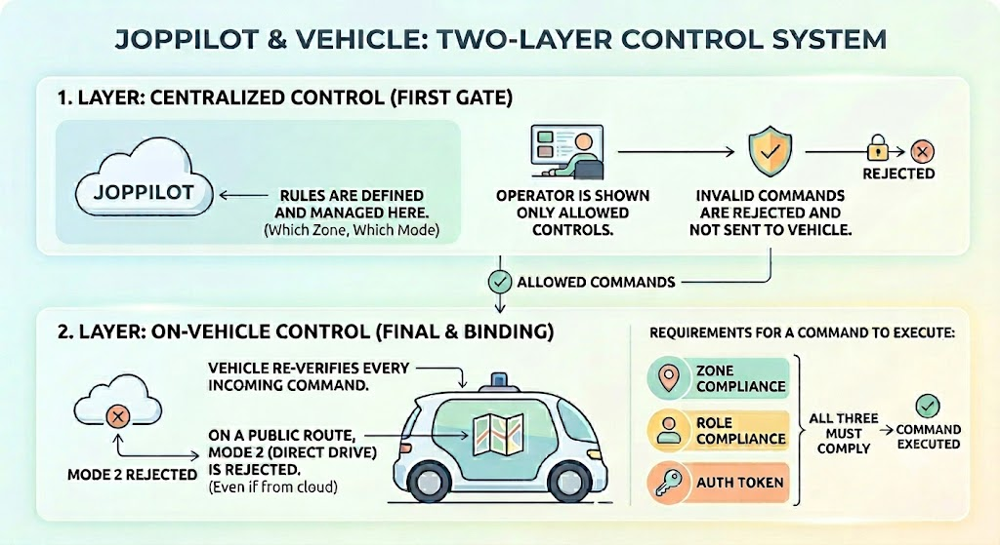
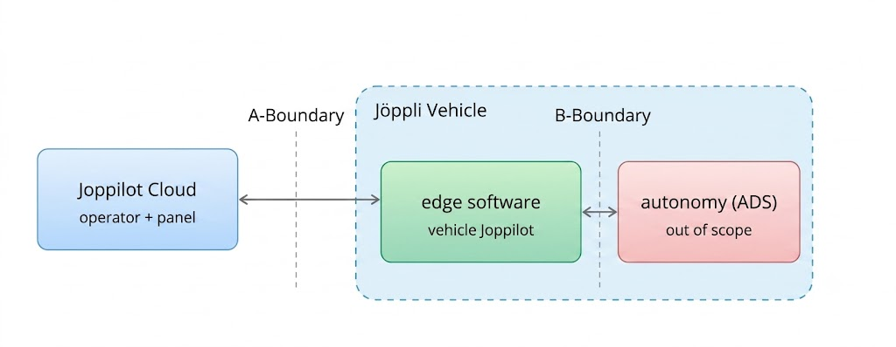

# Joppilot - Interface Contract / ICD
  
> To establish the core boundary of the system before drawing the architecture. The rules for remotely supervising the vehicle (which command goes where, what the vehicle reports, what happens if the connection drops) are defined in this document.

## 1. Operation Modes

There are two fundamental forms of remote vehicle management. Which one applies depends on **the zone in which the vehicle is located**.
 
- **Mode 1 - Supervision & Assistance:** Only on **public, canton-approved routes**. The operator does not drive the vehicle; they approve/reject/select alternatives for maneuver proposals offered by the autonomy. (Swiss law permits remote *supervision*, not remote *driving*, on public roads.)

- **Mode 2 - Direct Remote Driving:** Only in **non-public** areas (depot, private premises, permitted test zones). The operator drives directly via joystick/gamepad.

> In addition to these, **Diagnostics** (service/computer/sensor restart, configuration) is available in a limited manner in every zone.
 
> **Supervision is two-layered.** The rules (which zone permits which mode) are centrally defined and managed in Joppilot. Joppilot is the **first gate**: it never shows a disallowed control to the operator and rejects an invalid command before sending it to the vehicle. **The final and binding check is on the vehicle**: The line connecting the vehicle to the cloud can drop, be delayed, or be spoofed (tunnel/valley dead zones, forged commands). For this reason, the vehicle re-validates every command from the cloud against its own knowledge of the zone; on a public route, it **rejects** direct driving (Mode 2) commands regardless of what the cloud sends. For a command to be executed, the **zone + role + authorization token** must all match.

 
* **Development and testing (permitted exception).** If a **test/trial permit** has been obtained from the canton for a public segment, both Mode 1 and Mode 2 driving can be performed on that segment (e.g., with Super Admin / Remote Driver). However, this authorization arises not from a person disabling a rule at runtime, but from the **zone configuration defined by the permit**: the relevant zone is marked as open to Mode 2 based on the permit - together with the validity window, permitted modes, and conditions (speed limit, etc.); this configuration is distributed to the vehicle and enforced on the vehicle. Thus, authorization always remains **permit-based, time-limited, and logged**; no role (including Super Admin) can create Mode 2 on an unpermitted public route. Changing the zone type is a controlled and logged operation, not an instant override.

| Zone | Mode 1 | Mode 2 | Diagnostic Read | Diagnostic Actions |
|---|---|---|---|---|
| Public approved route | yes | no (vehicle rejects) | yes | yes (restricted)* |
| Public + valid test permit | yes | yes (in permitted zone, Remote Driver/Admin) | yes | yes |
| Depot / private / test site | yes | yes (if authorized) | yes | yes |
| Outside approved zone | no → safe stop | no → safe stop | yes | limited |

> *Diagnostic Actions: service/computer/sensor restart. "Restricted/limited" refers to the fact that restarting a sensor or computer while the vehicle is actively operating on a public road can create a momentary **perception/control gap**, so such disruptive actions are deferred to a safe state (IDLE / depot / maintenance).

## 2. System and Boundaries
 
There are **three** distinct parts in the system:
 
- **Joppilot cloud:** The server side (AWS). The operator screen, fleet panel, the place from which commands originate and where data is stored.
- **Edge software (VEA):** Joppilot's component that runs *on the vehicle*. Receives commands, sends telemetry and video; enforces safety rules **locally, without internet** even if the connection drops.
- **Autonomy (ADS):** The software that drives the vehicle in autonomous mode. It is outside Joppilot's scope (SCP-03). During autonomous driving, the ADS produces the steering/throttle/brake decisions; Joppilot does not produce autonomous driving decisions on its own.

> Mode 2 - Direct Remote Driving: When the operator takes direct control in a depot/private area, the driving decision is made by the operator and the steering/throttle/brake inputs are relayed to the vehicle through Joppilot (cloud → edge → vehicle). In other words, Joppilot does not produce autonomous driving decisions; but in Mode 2, it is the pathway that carries the operator's driving inputs. (Whether these inputs land on low-level drive control directly on the vehicle or go through the autonomy stack is still an open point - see Section 11.)

There are **two boundaries** between these parts:
 
| Boundary | Between whom | What passes through | Who designs |
|---|---|---|---|
| **A-Boundary** | Cloud ↔ edge software | Commands, telemetry, video/audio, heartbeat, updates | Entirely Joppilot |
| **B-Boundary** | Edge software ↔ autonomy (ADS) | Maneuver proposals, enable/disable autonomy, status | Joppilot **+ autonomy team jointly** |
 
> Summary principle: Joppilot **approves** proposals coming from the B-boundary; it does not produce driving decisions itself. The safety rules at the A-boundary operate on the vehicle, independently of the cloud.

## 3. Channels flowing across boundaries
 
The A-boundary consists of the following logical channels. (Here, what is defined is not the technology, but **what is carried** and **how fast/reliably it must be**.)
 
| Channel | Direction | Note |
|---|---|---|
| Command | Cloud → vehicle | All control/supervision commands. Every command is acknowledged (ACK/NACK). |
| E-STOP | Cloud → vehicle | Emergency stop. Sent **simultaneously via two separate messages**. Highest priority.* |
| Telemetry / diagnostics | Vehicle → cloud | Sensor + vehicle health data, continuous and real-time. |
| Heartbeat | Vehicle → cloud | "I'm here, I'm healthy" signal; feeds the safe mode decision. |
| Video / audio | Vehicle → cloud (audio is bidirectional) | Activated on demand; streams continuously and with low latency during active driving/supervision (not always-on by default). Multi-camera + bidirectional audio with the person at the vehicle (calm/authorized). |
| Maneuver proposal | ADS → edge → cloud → operator; approval in reverse | For Mode 1 |
| Log synchronization | Vehicle → cloud | Records accumulated during offline periods are transferred losslessly once the connection is restored. |
| Update | Cloud → vehicle | Software/configuration; staged and rollback-capable. |
 
> The command/E-STOP path must be **faster and more reliable** than the video path (the command path continues even if the video degrades); and no channel attempts to "catch up with delayed data" for live control. However, the vehicle records interim data and transfers it to Joppilot once the connection is restored.
 
> *The emergency stop signal is technically sent **simultaneously via two independent channels** (e.g., over different carriers/transmission paths). Normal commands go through a single channel and are retried if they don't arrive; E-STOP cannot wait for retries - it must arrive on the first attempt. The signal is duplicated so that if one path drops/is congested, the other one gets through. The vehicle stops based on whichever arrives first; the second copy is deduplicated by `command_id` (no double stop). The goal is that the most critical command does not depend on a **single point of failure**. If both fail to arrive (complete connection loss), the on-vehicle mechanism described in Section 10 transitions to safe mode on its own.

## 4. Commands 

> ⚠️ TODO: This section will be expanded.
 
### Mode 1 (public route) - high level / supervision
- **Autonomy & maneuver:** approve / reject / select alternative maneuver · enable / disable autonomy · return to autonomy.
- **Safe stop:** safe stop (controlled pull-over) · **E-STOP**.
- **Mission & fleet:** start / pause / cancel mission · skip next stop · return to depot · send to charging station · route to specific location.
- **Signaling & environment alert:** horn · hazard / warning lights · external speaker announcement or external display message (for pedestrians and surroundings).
- **Recycling operation:** mark collection as "completed" (confirm or correct type/weight record).
- **Communication & personnel safety:** intercom (bidirectional audio with the person at the vehicle) · personnel safety actions at the vehicle (proximity warning, compartment locking, etc.).
- **Operations:** confirm pre-departure check · acknowledge / clear warning ·

### Mode 2 (permitted zone only) - direct driving / low level
- **Driving:** drive (steering / throttle / brake) · select direction (forward / reverse) · turn.
- **Stopping:** park / engage parking brake · release.
- **Lights & signals:** horn · headlights · turn signal (right / left) · hazard lights.

*(E-STOP and safe stop are valid in both modes.)*
 
### Diagnostics
- Restart service / computer / sensor · adjust fps based on connection status / auto fps · update configuration · pull warning/error log.
 
### "Envelope" carried by every command
Every command carries a fixed envelope that answers the questions who/what/with which authorization: **unique command ID, session ID, target vehicle, command issuer, mode, authorization token, timestamp, time-to-live, and signature**. Three behaviors arise from this:
 
- **The authorization token is validated on the vehicle.** If the vehicle has seen a newer token, it rejects commands with the old token. This prevents two operators from simultaneously commanding the same vehicle.
- **If the same command arrives twice, it is applied once** (by command ID). The duplicate command receives the same response.
- **A command whose time-to-live has expired is not applied.** A delayed/stale command is a safety risk.

> E-STOP is sent simultaneously via two separate channels and is never queued under any circumstances. No command - including automated recovery - can override the locked "safe stop" state on its own; only an authorized explicit action can resolve it.

## 5. Data from the vehicle (telemetry)

> ⚠️ TODO: This section will be expanded.
 
The vehicle continuously reports in real time: position, speed, battery (V/A/°C/charge), fault codes (DTC), sensor data, sensor health, computer health, connection quality (latency/loss/bandwidth per carrier), and **vehicle status summary** (connection × health × mode). Only operationally necessary data is transmitted.

## 6. Maneuver proposal contract (Mode 1)
 
When the autonomy cannot resolve a situation on its own - with legally required lead time - it produces a **proposal**; Joppilot presents it to the operator as a card; the operator decides. The proposal carries the following information:
 
- proposal ID and which vehicle,
- why it could not be resolved (classified reason),
- context (location, scene summary, related sensor references),
- options (each: description + expected outcome),
- **decision time window**,
- the **safe default** the autonomy will apply if the time expires.

Three rules: The operator's approval/rejection is also a regular Mode 1 command (same envelope, token, logging). Joppilot presents the proposal **without modification** (the driving decision belongs to the autonomy). If no approval comes within the time window, the vehicle does not wait and lock up - it transitions to the safe default. The details of this boundary (reason set, option semantics, time values) are **frozen jointly with the autonomy team**.

## 7. Pre-departure check
 
Which checks must be performed is determined by law (OAD): at a minimum, brakes, steering, tires, lights, and safety-critical faults detected by self-diagnosis* must be checked before every operation.

> *Items whose failure directly endangers safe operation - brakes, steering, tires, lights; plus critical faults surfaced by self-diagnosis (e.g., a perception sensor/propulsion system/brake-by-wire fault).

Process:
1. Joppilot displays the legal checklist to the operator (periodic / pre-departure).
2. The result of each item comes from the vehicle's **automatic self-diagnosis** wherever possible; items not covered by self-diagnosis are verified by the operator.
3. **The operator reviews and confirms the results.** Operation begins only when confirmation is given and no **safety-critical** item has **failed**.
4. All checks and confirmations are logged (event record / LEG-04).
 
## 8. Single operator lock and handover
 
Only **one operator** at a time holds active authority over a vehicle. Authority is represented by the **authorization token**. A handover or administrator intervention elevates the token to **a higher value**; commands with the old token are rejected on the vehicle. Every handover is logged.
 
## 9. Connection loss: transition to safe mode
 
This behavior is provided by the **local mechanism** on the vehicle; it does not depend on the internet. The vehicle sends regular "heartbeat" signals; to prevent sporadic packet loss from triggering false alarms, loss is evaluated **over several windows**. Safe mode is triggered in at least the following situations: connection loss, heartbeat loss, video freeze/latency, approved zone (geofence) violation.
 
The response is graduated and speed-adapted: first speed/quality is reduced, control is preserved as long as possible, and if necessary, a controlled stop is performed. A slow-moving vehicle is given more time; but the guarantee of transitioning to safe mode is never compromised. The "safe stop" state is **locked**: the vehicle does not move on its own until an authorized person explicitly resolves it, and every entry creates an event record.
 
**When the connection returns:** records accumulated on the vehicle during the offline period are **uploaded losslessly** to Joppilot (RES-02). However, the restoration of the connection alone does **not resolve** the locked "safe stop"; the vehicle resumes movement only upon an authorized explicit action.

## 10. Topics not repeated in this document but also applicable to the interface
 
The following are defined in `joppilot_constraints.md` and apply to this interface as well.
 
- **Security:** end-to-end encryption + mutual authentication, the vehicle's key material cannot be extracted, instant disconnection upon authorization revocation (SEC-01…09).
- **Privacy / data protection:** data minimization, video on demand, anonymization of third parties (faces/license plates), anonymity of municipal reports, retention and data subject rights (DAT-01…10).
- **Event data logging:** time-synchronized, complete, tamper-evident recording of session/command/decision data and chain of evidence (LEG-04/05). Interface-specific addition: The proposal-decision-outcome chain from Section 7 and every "safe stop" event from Section 10 are written to this log.
- **Software update:** staged rollout + rollback (STD-02). Interface-specific addition: the update flow cannot silently interrupt a locked "safe stop" state or an active session.
- **Accessibility:** WCAG 2.1 AA for the operator interface, especially keyboard accessibility of the E-STOP (ACC-01…05).

## 11. Points not yet decided
 
| Topic | Who decides |
|---|---|
| Final latency thresholds for command/E-STOP/video | To be validated with POC/pilot |
| What exactly is stored in the event log, how long it is retained | Privacy officer + legal/insurance + authority |
| B-boundary proposal schema (reason set, option semantics, timing) | Autonomy team |
| Parameter model for canton (GL/ZH/BS) zone conditions | Authorization process |
| Heartbeat period and thresholds, Mode 2 watchdog timers | Autonomy team; tuned during pilot |
| Where Mode 2 driving inputs land on the vehicle (low-level drive control or through the autonomy stack) | Autonomy team |
