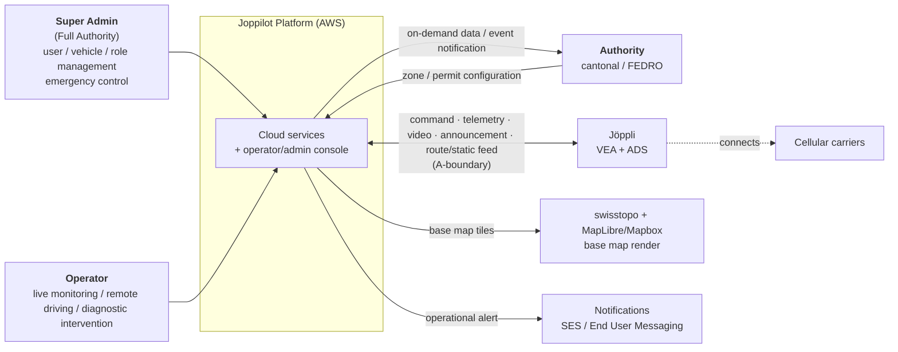
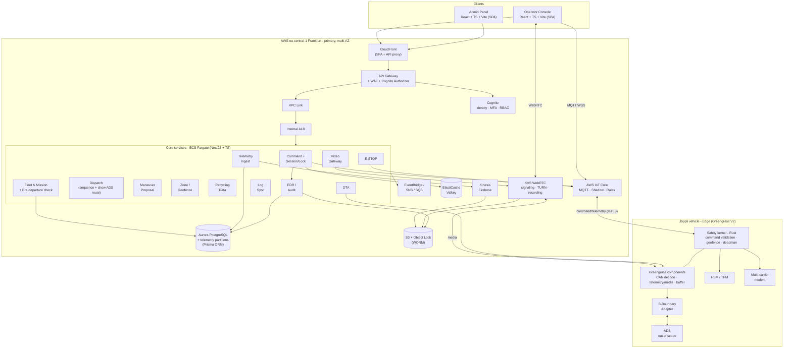
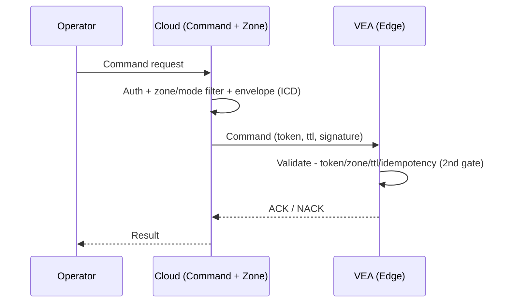
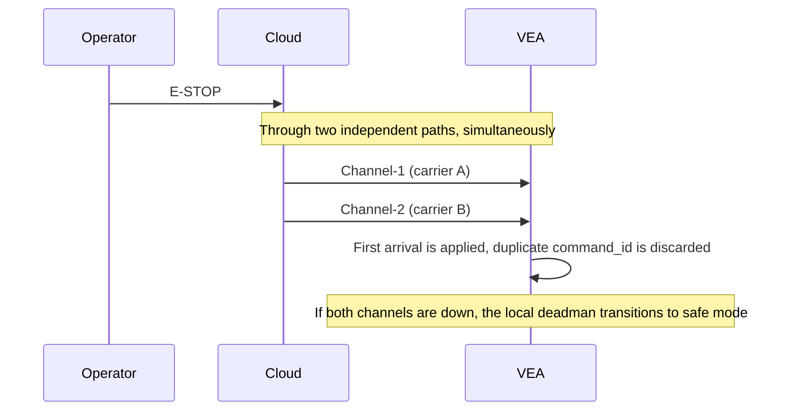
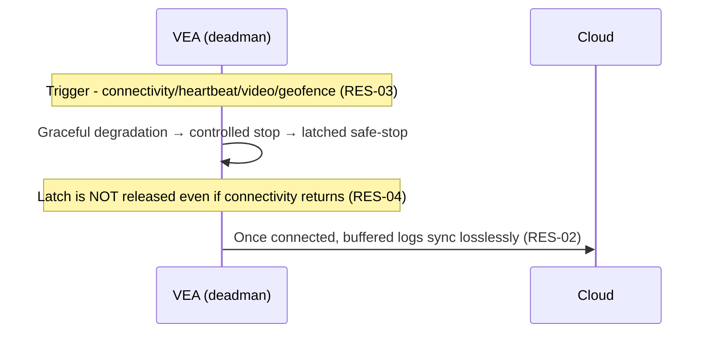
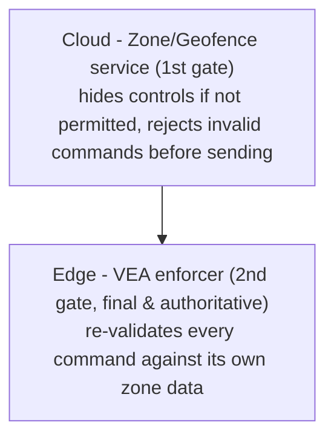
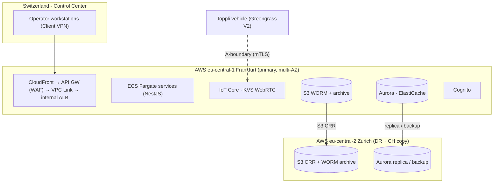

# Joppilot - Software Architecture

**Scope:** Joppilot - Fleet Management & Remote Control/Supervision Platform

> This document defines **the software architecture only**. Constraint codes (SCP/LEG/DAT/SEC/RTP/RES/PLT/ACC/LNG/OPS/STD) belong to `joppilot_constraints.md`; mode/command/boundary details belong to `joppilot_interface_contract.md` (ICD).

## 1. Purpose & Architectural Drivers

Architecturally significant constraints that shape the architecture (full text lives in the constraints document; only architectural impact and codes are listed here):

| # | Driver | Architectural impact | Constraint |
|---|---|---|---|
| PAD-1 | Real-time | Telemetry/video/command/E-STOP on **separate channels** with different latency-reliability guarantees; command path independent of and stricter than video | RTP-01…08 |
| PAD-2 | Failsafe | On connectivity loss, **vehicle-side, cloud-independent** transition to safe mode; latched stop | RES-01…06 |
| PAD-3 | Security | End-to-end encryption + mutual authentication, MFA, single-operator lock, WORM audit, immediate revocation | SEC-01…10 |
| PAD-4 | Resilience | Multi-carrier connectivity, graceful degradation, offline buffer + lossless sync, dual-path E-STOP | RES-05/06, RTP-08 |
| PAD-5 | Legal compliance | Zone-based mode management, operator located in Switzerland, pre-departure check, time-synced/tamper-evident event recording | LEG-01…07 |
| PAD-6 | Data protection | Data minimization, on-demand video, face/plate anonymization, data subject rights | DAT-01…10 |
| PAD-7 | Scale | ~10 vehicles, ≥5 cameras/vehicle; choices that do not block vertical growth | OPS-01…04 |

## 2. C4 Level 1 - System Context

The real external dependencies are the **vehicle**, **cellular carriers**, and the **map tile source** (swisstopo, rendered with MapLibre/Mapbox). Notifications are an AWS managed service (part of the platform). **Path-level routing and static map components (stops, signs, lights, lanes) come from the vehicle's ADS/HD map** (via the B-boundary, surfaced over the A-boundary) - Joppilot renders them and performs dispatch sequencing, but does not compute driving routes. There is no separate console for authorities (on-demand data/EDR + event notifications); cantonal approvals enter the system as **zone configuration**.

## 3. C4 Level 2 - Container

## 4. Core Data Flows

> Command envelope fields, ACK/NACK, and the maneuver proposal schema are defined in the **ICD**; only the **architectural** sequence is shown here.

### 4.1 Command flow (Mode 1/2)

### 4.2 E-STOP flow

### 4.3 Failsafe flow

## 5. Architectural Realization of Zone-Based Authorization

Mode (Mode 1/2) ↔ zone type rules, the **zone-mode matrix**, and the **test permit exception** are defined in the **ICD**. Architecturally, this is realized as a **two-layer** enforcement:

The final, authoritative enforcement resides **on the vehicle** (the cloud can err/disconnect/be attacked - RES-01, SEC-04). Cantonal approvals and test permits enter the system as **zone configuration**; no role (including Super Admin) can override rules at runtime.

## 6. Technology Stack (managed-first)

> **Principle:** Default to a **managed (off-the-shelf) AWS service**. Self-hosting is recommended only if (a) the managed service would create a **major problem** in the future, (b) **no clear managed service** meets the need, or (c) a managed service cannot satisfy a **mandatory requirement** (low latency, security, data residency) (PLT-03). This document contains only **two** self-host exceptions (both marked); plus a deliberate, justified use of **non-AWS map providers** (swisstopo/MapLibre/Mapbox) for Swiss-authoritative geodata.

### 6.1 Cloud layer

| Layer | Choice (managed) | Rationale | Self-host if needed |
|---|---|---|---|
| Infrastructure | **AWS** (PLT-01) | Constraint | - |
| CDN + front door | **CloudFront** | SPA distribution + proxies API traffic to API Gateway; DDoS protection, edge caching | - |
| API gateway | **API Gateway + WAF + Cognito Authorizer → VPC Link → internal ALB** | single entry point; throttling, authorization, and WAF on a single surface; ECS is **never** publicly exposed | - |
| Identity / RBAC | **Amazon Cognito** | MFA (SEC-03), invite-only, group→role | Keycloak only if fine-grained RBAC is insufficient |
| Command/telemetry backbone | **AWS IoT Core + Greengrass V2** | managed MQTT, Shadow, Rules, mTLS, OTA | - |
| Fleet security monitoring | **IoT Device Defender** | certificate/anomaly auditing (SEC-10) | - |
| Video/audio | **KVS WebRTC** *(POC gate)* | managed signaling+TURN+recording, on-demand, two-way audio | **If POC fails:** LiveKit/mediasoup + coturn (EC2) - *exception (c)* |
| Command channel | **WebRTC Data Channel + IoT Core MQTT QoS1 fallback** | two paths; fencing token; dual-path E-STOP (RES-05) | - |
| Relational + telemetry | **Aurora PostgreSQL** (+ pg_partman) | Timestream LiveAnalytics closed to new customers, TimescaleDB not available on RDS | alt: Timestream for InfluxDB (behind a DAO) |
| ORM / migration | **Prisma** (relational/business data) | type-safe queries, migration management; natural fit with TS backend | - |
| Telemetry hot-path | **Raw/batched insert** (not Prisma) | high-frequency writes bypass ORM overhead; partition mgmt via pg_partman/raw SQL | - |
| Raw data / archive | **S3 + Glue + Athena**, Kinesis Firehose | managed data lake | - |
| Event recording (EDR) | **S3 + Object Lock (WORM)** | tamper-evident evidence (SEC-06, LEG-04/05) | - |
| Cache/session/lock | **ElastiCache (Valkey)** | low latency, single-operator lock (SEC-05) | - |
| Map rendering (frontend) | **MapLibre GL JS** (or Mapbox GL JS) | renders base map from swisstopo tiles; MapLibre avoids 3rd-party token / US telemetry; **route/path is not computed here** | - |
| Map data source | **swisstopo (geo.admin.ch)** | Switzerland's authoritative, free geodata; cantonal boundaries, tunnels/alpine roads, LV95; used for base map + zone/route **definition** | - |
| Route / path + ETA | **ADS / HD map (via B-boundary)** - *open* | path-level routing and static components (stops, signs, lights, lanes) come from the autonomy HD map; Joppilot runs **no routing engine** (keeps location data in-region, adds no 3rd self-host); Joppilot only renders the route and performs **dispatch sequencing** (stop ordering, ~10 vehicles) | feed schema TBD with ADS team (OP-9) |
| Geofence management | **Custom service** (Aurora + Valkey cache + edge push) | polygon authoring → stored in Aurora → cached in Valkey → pushed to the vehicle edge; **enforcement resides on the vehicle**, no dependency on a cloud service | - |
| Internal events / alerts | **EventBridge + SNS + SQS** | managed | - |
| Notifications | **SES + AWS End User Messaging** | managed (Pinpoint closed) | - |
| Security suite | **WAF, Shield Std, GuardDuty, Security Hub, Inspector, Macie, KMS, Secrets Manager, CloudTrail** | managed | - |
| Observability | **CloudWatch + X-Ray** (+ OpenTelemetry SDK) | SLO/latency monitoring | - |
| Network access control | **AWS Client VPN** + IP-based SGs | operator access only from the Swiss control center (LEG-02, SEC-07) | - |
| VPC endpoints | **ECR, S3, CloudWatch Logs, Secrets Manager, KMS, STS** | controls NAT data-processing costs | - |
| IaC / CI-CD | **Terraform + GitHub Actions** | reproducible; both regions (Frankfurt + Zurich) bootstrapped via IaC | - |

> **Note - Map & routing rationale:** swisstopo is Switzerland's official geodata source (authoritative cantonal boundaries, alpine roads, tunnels); the base map is rendered client-side with MapLibre GL JS (Mapbox GL JS optional). **Routing was intentionally moved out of Joppilot:** the vehicle's ADS already plans the path on its HD map (which also defines static components - stops, signs, lights, lanes), so Joppilot consumes a **planned-route + ETA + static-component feed** from the ADS over the B-boundary rather than computing routes itself. This keeps all location data in-region (no off-EU egress), avoids adding a third self-host engine, and leaves driving routing where it belongs (the ADS). Joppilot's remaining map duties are **display** (overlay the ADS route on the swisstopo base map) and **dispatch sequencing** (which vehicle visits which stops, in what order). **This split is pending confirmation that the ADS can publish a clean route/ETA feed - see OP-9; a coarse fallback ETA is tracked in OP-10.**

> **Note - Ingress architecture:** All client traffic (SPA + API) enters through CloudFront. API calls follow the chain CloudFront → API Gateway (WAF + Cognito Authorizer) → VPC Link → **internal ALB** → ECS Fargate. ECS is never publicly exposed; WAF and authorization are consolidated on a single surface.

> **Note - WAF placement (implementation status, M2-3c):** The implemented API Gateway is an **HTTP API** (cheaper than REST, free VPC Link). AWS WAF cannot attach to HTTP APIs (REST-only), so the WebACL is attached to the **internal ALB** one hop behind instead — every request still flows API Gateway → VPC Link → ALB, so the same traffic is inspected. This changes the WAF *attachment point*, not the technology choice: API Gateway stays. **End state:** once CloudFront fronts the stack (with SPA hosting), the WAF moves to **CloudFront**, protecting SPA + API at the edge as AD-19 intends. Switching to a REST API purely to host WAF is rejected (higher cost, NLB-based VPC Link). **CloudFront itself is not yet deployed** — it lands together with the console SPA's cloud deployment (post M2-5); until then API Gateway is the outermost public surface.

> **Note - In-VPC transport encryption (accepted deviation, M2-3c/M2-4):** SEC-02 [M] requires all data in transit to be encrypted. As implemented, TLS terminates at **API Gateway**; the in-VPC hop behind it (API Gateway → VPC Link → internal ALB → ECS) runs **plain HTTP**. This is a **recorded, accepted deviation**, justified as follows: the segment never leaves the VPC's private subnets (no internet gateway route), and security groups pin the path end-to-end (the ALB accepts traffic only from the VPC Link ENIs, tasks only from the ALB) — a compensating control against on-path interception; terminating TLS on the internal ALB would require certificates the ALB can serve for a private name, i.e. **AWS Private CA (~$400/month)**, disproportionate at the current stage where no real personal or operational vehicle data flows through the stack. **Closure condition:** revisit **before production traffic carries real personal data (nDSG) or live vehicle command traffic**, and at latest in the **CloudFront + custom domain phase** (ACM public certs on a real domain change the cost calculus; options then: internal TLS via Private CA, or end-to-end mTLS via a service mesh). Until closed, this note is the audit reference for the SEC-02 gap.

### 6.2 Edge (on-vehicle) layer

| Component | Choice | Rationale |
|---|---|---|
| Operating system | Linux-based embedded OS | real-time, hardware support |
| **Safety kernel** | **Rust (Greengrass custom component)** - *exception (a)+(c)* | deadman/geofence/enforcer must be deterministic, GC-pause-free, and operate with **zero connectivity** (RES-01); no managed service provides this on-vehicle |
| Other edge tasks | **Greengrass V2 components** | CAN decode, telemetry/media streaming, buffer, OTA - managed |
| Secure key storage | **HSM / TPM** | keys non-extractable, tamper detection (SEC-08) |
| Connectivity | **Multi-carrier bonded modem** | availability (RES-05); *not a legal requirement; does not solve common dead zones - safety relies on the failsafe* |
| B-boundary protocol | ROS 2 / gRPC / custom - **open** | jointly with the ADS team (OP-5) |
| Route/static feed | **planned route + ETA + static components from ADS HD map** - **open** | consumed over the B-boundary; format/cadence TBD with ADS team (OP-9) |

### 6.3 Client layer

| Component | Choice | Rationale |
|---|---|---|
| Operator console + Admin panel | **React + TypeScript + Vite** (SPA → S3 + CloudFront) | SPA; real-time + WebRTC + Gamepad API; static deploy (no server runtime needed); front+back same language (TS) |
| i18n | **react-i18next** (key-based, ICU format) | de-CH + en primary; fr-CH/it-CH can be added (LNG) |
| Accessibility | WCAG 2.1 AA + eCH-0059 | E-STOP keyboard accessibility included (ACC) |

**Languages:** front + back **TypeScript**; **Rust only in the on-vehicle safety kernel**. If a hot-path bottleneck is measured in a cloud service, that service may be migrated to Go (open decision).

**Backend framework:** **NestJS** (TypeScript). Modular architecture, built-in WebSocket/MQTT support, automatic OpenAPI 3.1 generation (decorator-based), dependency injection, Guard/Interceptor pattern (RBAC, fencing token validation). **Prisma** is used as the ORM for relational/business data.

> **Note - Relational DB engine (interim deviation from AD-14, M2-4-2):** AD-14 prescribes **Aurora PostgreSQL**; the dev environment currently runs a **single free-tier RDS PostgreSQL instance (db.t4g.micro)** instead. Reason: the AWS account is on the **free account plan**, which only permits Aurora as an "express configuration" cluster — VPC-less, reachable solely through a public internet access gateway, IAM-auth-only, no CMK. That contradicts the ingress posture (nothing public but API Gateway), SEC-02 (customer-managed keys), and the Secrets Manager credential flow, so plain RDS inside the VPC preserves every security property (private subnets, KMS CMK, RDS-managed secret) at the cost of the Aurora engine itself. **Closure condition:** when the account moves to a paid plan (at latest when scale or the Zurich DR replica demands Aurora), swap the `rds` Terraform module back to the Aurora Serverless v2 module preserved in git history — the services are agnostic (same private Postgres endpoint + secret contract), and data is reproducible from committed Prisma migrations. The free plan also caps backup retention at 1 day; restore to 7+ on upgrade.

> **Note - Migration execution (implementation status, M2-4-2):** command and fleet share **one PostgreSQL database with separate Postgres schemas** (`?schema=command` / `?schema=fleet`); each service owns its committed migration history, and the **container entrypoint runs `prisma migrate deploy` against its own schema** before the app starts (`migrate deploy` takes an advisory lock, so concurrently starting tasks cannot collide; a failed migration keeps the new task from starting while the rolling deploy keeps the old version alive). **Accepted simplification:** the runtime DB identity holds DDL rights — there is no migrate/runtime role split yet. **Closure condition:** when DB users are split into least-privilege roles — at latest before real personal data (nDSG) flows — migration execution moves to a CI-driven one-off ECS task.

> **Note - Prisma limitations:** (1) **Telemetry:** Prisma does not manage native PostgreSQL partitioning and adds overhead on high-frequency writes; the telemetry ingest hot-path uses pg_partman + raw/batched inserts (or IoT Rules → Firehose/Aurora), not Prisma. (2) **Booking (future):** PostgreSQL's `EXCLUDE USING gist` constraint (double-booking prevention) is not natively supported in Prisma; if booking is brought into scope, this must be added via a raw SQL migration.

## 7. Third-Party / External Dependencies

| Dependency | Purpose | Critical? | Note |
|---|---|---|---|
| **Cellular carriers** (Swisscom/Sunrise/Salt) | Vehicle ↔ cloud | Yes | bonded multi-carrier; **availability** (RES-05), not a legal requirement |
| **swisstopo (geo.admin.ch)** | Swiss geodata source | Yes | free, authoritative; base map + zone/route definition, LV95↔WGS84 conversion |
| **MapLibre / Mapbox GL JS** | base map rendering (frontend) | Medium | render only; **no routing** (routing comes from ADS); MapLibre keeps it 3rd-party-free |
| **Notifications** (SES / End User Messaging) | operational alerts | No | AWS managed |
| **OEM / ADS** | vehicle hardware + autonomy + **planned route/ETA/static-component feed** | Yes | only via the **B-boundary** (SCP-03); route feed schema open (OP-9) |

(Municipality data systems, municipality reporting, resident notifications, payments: out of scope or not yet finalized - separate documents.)

## 8. Deployment View

**Why Frankfurt as primary:** IoT Core and KVS WebRTC are **not available in the Zurich (eu-central-2) region**; the revFADP permits EU/EEA hosting (adequacy) (DAT-08). **Zurich** is used for DR and a data copy on Swiss territory. Operators are physically in Switzerland (LEG-02). If a future contract mandates Swiss-resident primary data, Aurora/S3 primaries can be moved to Zurich (PLT-02; documented Option B).

## 9. Scaling

The binding current scale and camera/vehicle targets are defined in the **constraints** (OPS-01/02, RTP-01); the design is sized for this scale.

| Dimension | Strategy |
|---|---|
| **Target scale** | **~10-vehicle fleet**; all tests and sizing are performed at this scale (OPS-01) |
| Video sessions | On-demand; concurrent session count is independent of fleet size (OPS-04) |
| Vertical growth | Not a primary goal; however, critical choices (ECS/Aurora/Valkey) must not block future scaling (OPS-03) |

## 10. Cross-Cutting Concerns (architectural realization)

> Requirements are in the constraints; here we document **how the architecture addresses them**.

- **Audit / EDR:** critical actions written to **S3 Object Lock (WORM) + Aurora append-only**, correlated by a correlation id (SEC-06, LEG-04/05).
- **i18n:** key-based translation infrastructure (react-i18next, ICU format); Swiss formats - number: 1'234.56, date: dd.mm.yyyy, timezone: Europe/Zurich (LNG-04).
- **Accessibility:** frontend WCAG 2.1 AA / eCH-0059; E-STOP keyboard accessibility (ACC).
- **Privacy:** video **on-demand** (RTP-07); face/plate **anonymization** at the edge/processing pipeline; data minimization and retention enforced at service boundaries (DAT-03/05/06).
- **Security:** mTLS + Cognito + KMS + Secrets Manager; the command channel is the highest-protection surface (SEC-01…10).
- **Recycling data:** household-level collected data requires anonymization/pseudonymization (DAT-04); the Recycling Data service enforces these principles.
- **Pre-departure check:** supported as a digital workflow (LEG-03); within the Fleet & Mission service; results are written to the audit log.

## 11. Architectural Decisions

### 11.1 Decisions taken
| # | Decision | Constraint |
|---|---|---|
| AD-1 | Run on AWS | PLT-01 |
| AD-2 | Two-layer command validation (cloud + vehicle) | SEC-04, RES-01 |
| AD-3 | E-STOP via two independent channels | RES-05 |
| AD-4 | Video on-demand | RTP-07, DAT-03 |
| AD-5 | Zone-based mode management | LEG-01 |
| AD-6 | Connectivity-independent local failsafe | RES-01 |
| AD-7 | WORM audit log | SEC-06, LEG-04/05 |
| AD-8 | Operator in Switzerland (VPN/network restriction) | LEG-02, SEC-07 |
| AD-9 | Single-operator lock (fencing token) | SEC-05 |
| AD-10 | **Managed-first principle** (self-host only for 2 exceptions) | PLT-03 |
| AD-11 | Backbone: IoT Core + Greengrass V2 | - |
| AD-12 | Video: KVS WebRTC (POC gate; self-host SFU if it fails) | RTP-06 |
| AD-13 | Identity: Cognito | SEC-03 |
| AD-14 | Telemetry: Aurora partitions (Timestream closed, TimescaleDB not on RDS); raw/batched writes, not Prisma | RTP-02/03 |
| AD-15 | Maps: base render via swisstopo + MapLibre/Mapbox; **route/path + static components from ADS/HD map via B-boundary**; Joppilot does dispatch sequencing only; geofence via custom service (Aurora + Valkey + edge push) | RTP-04/05 |
| AD-16 | **Edge safety kernel: Rust** (self-host exception) | RES-01, SEC-08 |
| AD-17 | Frankfurt primary + Zurich DR | DAT-08, PLT-02 |
| AD-18 | Languages: TS (front+back), Rust (edge) | - |
| AD-19 | Ingress: CloudFront → API Gateway (WAF + Cognito) → VPC Link → internal ALB → ECS | SEC |
| AD-20 | Frontend: React + TypeScript + Vite (SPA, S3+CloudFront) | - |
| AD-21 | Backend: NestJS + TypeScript; ORM: Prisma (relational only) | - |

### 11.2 Open decision points
| # | Topic | Decision owner |
|---|---|---|
| OP-1 | Exact latency thresholds for command/E-STOP/video + video POC go/no-go | Engineering (RTP-06) |
| OP-2 | What exactly is stored in the event record, and for how long | Privacy owner + legal/insurance (DAT-06) |
| OP-3 | B-boundary proposal schema (reason set, options, timing) | ADS team |
| OP-4 | Where Mode 2 drive inputs land on the vehicle (low-level vs. via ADS) | ADS team |
| OP-5 | B-boundary protocol (ROS 2 / gRPC / custom) | ADS + Joppilot |
| OP-6 | Cantonal (GL/ZH/BS) zone condition parameter model | Authorization process (LEG-06) |
| OP-7 | Heartbeat period/thresholds, Mode 2 watchdog timers | Edge/embedded team |
| OP-8 | Whether booking (rental) will be built | Product team (SCP-05) |
| OP-9 | **ADS → Joppilot route feed:** planned route + ETA + static map components (format, cadence) over the B-boundary; confirm the ADS can publish a clean feed | ADS + Joppilot |
| OP-10 | **Fallback dispatch ETA** when the ADS route feed is unavailable (e.g. straight-line × factor) so sequencing does not stall | Engineering |

### 11.3 Accepted deviations & deferred hardening — living register

> Single audit entry point: every DELIBERATE gap between this document's target state and what is deployed, each with the trigger that closes it. Detailed rationale lives in the note referenced per row. A new deviation is not accepted until it has a row here; a closed row is deleted, not struck through. (Scheduled *features* — WORM/EDR evidence copy, dual-path E-STOP, Client VPN, mTLS/signature enforcement, i18n, DR — are tracked in the timeline, not here.)

| # | Deviation / deferral | Target state (this doc) | Closure trigger | Detail |
|---|---|---|---|---|
| DEV-1 | WAF attached to the internal ALB | WAF at the edge on CloudFront (AD-19) | CloudFront lands with the SPA cloud deployment (post M2-5) | §6.1 WAF-placement note |
| DEV-2 | In-VPC hop (API GW → VPC Link → ALB → ECS) is plain HTTP | All transit encrypted (SEC-02) | Before real personal data (nDSG) or live vehicle command traffic; at latest the CloudFront + custom-domain phase | §6.1 in-VPC transport note |
| DEV-3 | Interim RDS PostgreSQL db.t4g.micro instead of Aurora | Aurora PostgreSQL (AD-14) | AWS account leaves the free plan (at latest when the Zurich DR replica is needed); Aurora module preserved in git history | §6 DB-engine note |
| DEV-4 | Backup retention 1 day (free-plan cap) | Defined, enforceable retention (DAT-06) | Same as DEV-3 — raise to 7+ on plan upgrade; full retention regime lands with the August data-infra work | rds module variable comment |
| DEV-5 | Migrations run in the container entrypoint with the master (DDL) identity | Least-privilege runtime DB users (SEC-04 spirit) | DB users split into migrate/runtime roles — at latest before real personal data; then move to a CI one-off ECS task | §6 migration-execution note |
| DEV-9 | Telemetry table lives in the default `public` schema (raw `pg` ignores `?schema=`) | One schema per service owner | Revisit with pg_partman partitioning (August); acceptable while telemetry owns a single table | README Prisma note |
| DEV-10 | Interface VPC endpoints in a single AZ | Multi-AZ posture of the rest of the stack | Production hardening — one endpoint per AZ | endpoints module comment |
| DEV-11 | In-memory zone registry + per-instance deadman timers + per-instance NO_ACK watchers in the command service (edge watchdog remains the authoritative failsafe; NO_ACK is visibility, not retry) | DB + Valkey-backed shared state (AD-15) | M2-4-3+, before the command service scales past one task | zone.service.ts comment / audit-2, audit-7 |
| DEV-12 | AWS account on the free plan (walls already hit: Aurora express-only, 1-day backups) | Unrestricted account | Decision point at M2-5 (IoT Core) and August (KVS WebRTC): verify free-plan availability BEFORE building; upgrade if blocked | m2 memory / audit-4 |
| DEV-13 | Pre-departure SELF_DIAGNOSIS items are auto-PASS placeholders (sim edge has no fault injection; not fed from live vehicle health) | ICD §7 step 2: results come from the vehicle's automatic self-diagnosis | M4-4 real-vehicle telemetry — wire checklist items to live sensor/DTC health | pre-departure.service.ts comment / audit-5 |
| DEV-14 | Admin zone API accepts any permit/site-authorization id without validating it against a canton-approved **zone-definition catalog** (geometry + conditions). Tightened in M2-5: EVERY Mode-2-capable zone type now requires an authorization artifact + validity window, delivered signed to the vehicle, and the edge auto-reverts past the window | ICD §1: cantonal approvals enter as controlled zone configuration validated against approved zone definitions | M3-5 zone work (AD-15 zone service: Aurora-backed catalog + geometry validation + edge permit consumption) | command.controller.ts setZone comment / audit-5, M2-5 |
| DEV-15 | Services read `cognito:groups` from the Bearer JWT WITHOUT re-verifying its signature in-process — the API Gateway JWT authorizer verified signature/issuer/audience/expiry at the edge, and the SG-pinned path is the only way in (JWKS egress impossible from the private subnets: no NAT; Cognito PrivateLink incompatible with a domain-assigned pool; HTTP API claim mapping breaks on the `cognito:groups` colon) | In-service verification of the role claim (SEC-03/04) | Same trigger as DEV-2: CloudFront + custom-domain phase (in-VPC TLS/mTLS or NAT/JWKS egress makes in-process verification possible) | roles.guard.ts trust note / M2-4-3 |
| DEV-16 | Telemetry's raw pg connection uses TLS to RDS (`DB_SSL=true`, rds.force_ssl) but does NOT verify the server certificate (`rejectUnauthorized: false`) | Verified TLS end to end (SEC-01/02) | Same trigger as DEV-2: in-VPC TLS work in the CloudFront/custom-domain phase (RDS CA bundle baked into the image or Private CA) | telemetry-writer.service.ts comment / M2-4-4 |
| DEV-17 | Fleet audit rows (checklist/mission — ICD §7 step 4, LEG-04) live in a separate `FleetEventRecord` table in the fleet schema, not the command EDR table (services own separate Prisma schemas) | One consolidated audit evidence store (SEC-06) | August WORM/EDR work: both tables feed the same S3 Object Lock evidence copy; correlationId links the chains until then | fleet prisma schema comment / audit-7 |
| DEV-18 | Pre-departure confirmation & mission lifecycle are cloud REST workflows only — the ICD §4 Mode 1 commands (`CONFIRM_PRE_DEPARTURE_CHECK`, `START_MISSION`, …) are not yet sent to the vehicle as envelopes | Operator workflow commands reach the vehicle over the command channel (ICD §4) | M3 (Greengrass edge + mission/checklist consumption on the vehicle) — cloud-side gating/audit landed in audit-7 | fleet.controller.ts note / audit-7 |
| DEV-19 | Command-signing private key (Ed25519, ICD §4) is terraform-generated → lives in the TF state (private S3 + lock); local dev uses a committed DEV key in .env.example. Vehicle-side public-key distribution is manual (env) until IoT provisioning | KMS-backed key generation/rotation; pubkey distributed via device provisioning | M2-5b IoT provisioning for distribution; KMS/rotation before production traffic (same class as DEV-2) | envs/dev/main.tf signing-key comment / M2-5 |
| DEV-20 | IoT X.509 certificate private keys are AWS-generated by terraform (`aws_iot_certificate`) → land in the TF state and in Secrets Manager (cert bundle per principal) | CSR/fleet-provisioning flow where the device private key never leaves the device (SEC-08) | Before production provisioning — real vehicles get keys via a CSR or fleet-provisioning template, not terraform | modules/iot/main.tf cert comment / M2-5b |
| DEV-21 | Kernel ↔ CARLA-bridge actuation IPC is unauthenticated localhost TCP/NDJSON (any local process could read verified commands or feed a spoofed pose). Compensating controls: loopback-only bind, bridge is a non-safety sim adapter, kernel latches on 3 s pose silence (fail-closed) | Agreed, authenticated B-boundary protocol with the ADS team (§6.2, OP-5); watchdog thresholds tuned per OP-7 | M4-1 B-boundary adapter work | edge/sim/src/main.rs actuation-IPC comment / M3-1 |