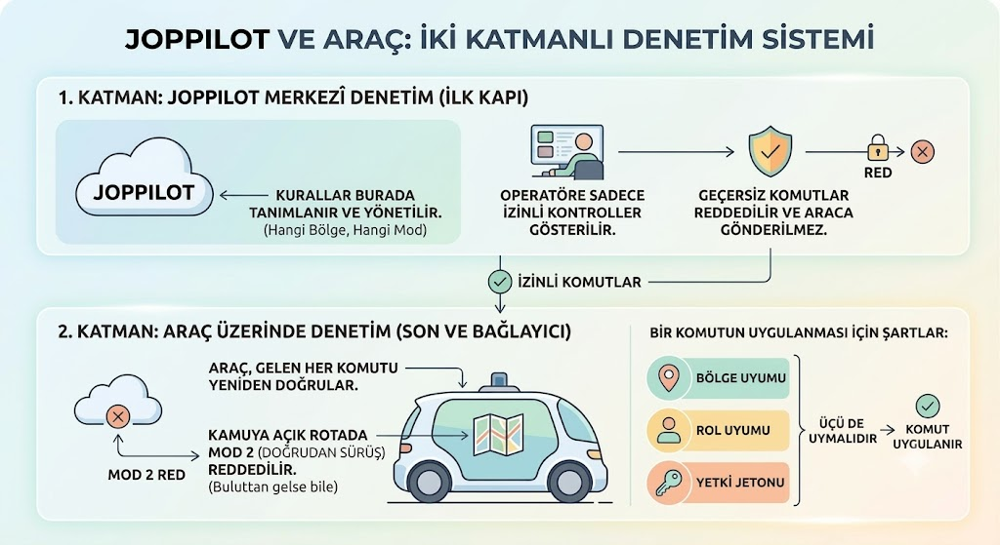
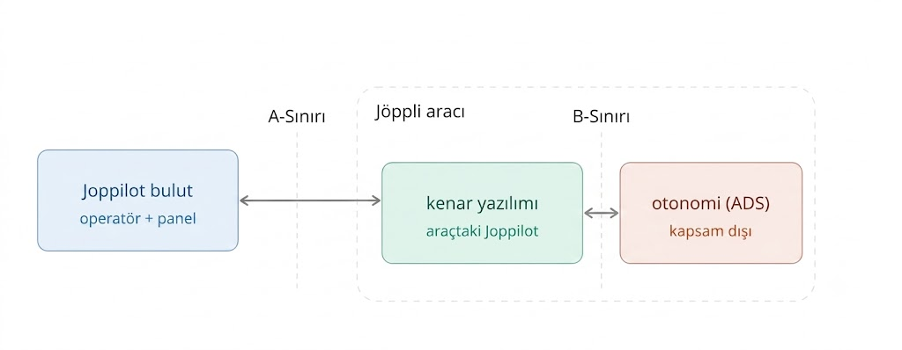

# Joppilot - Interface Contract / ICD
  
> Mimariyi çizmeden önce sistemin çekirdek sınırını sabitlemek için. Aracı uzaktan denetlemenin kuralları (hangi komut nereye gider, araç ne raporlar, bağlantı koparsa ne olur) bu dokümanda belirlenir.

## 1. Operasyon Modları

Aracın uzaktan yönetiminin iki temel biçimi vardır. Hangisinin geçerli olduğu **bulunulan bölgeye** bağlıdır.
 
- **Mode 1 - Denetim & Asistan:** Yalnızca **kamuya açık, kanton onaylı rotalarda**. Operatör aracı sürmez; otonominin sunduğu manevra önerilerini onaylar/reddeder/alternatif seçer. (İsviçre yasası kamuya açık yolda uzaktan *sürmeye* değil, uzaktan *denetlemeye* izin verir.)

- **Mode 2 - Doğrudan Uzaktan Sürüş:** Yalnızca **kamuya açık olmayan** yerlerde (depo, özel saha, izinli test alanı). Operatör joystick/gamepad ile doğrudan sürer.

> Bunların yanında **Diagnostics** (servis/bilgisayar/sensör yeniden başlatma, yapılandırma) her bölgede sınırlı biçimde geçerlidir.
 
> **Denetim iki katmanlıdır.** Kurallar (hangi bölge hangi moda izin verir) Joppilot'ta merkezî olarak tanımlanır ve yönetilir. Joppilot **ilk kapı**dır: izin verilmeyen bir kontrolü operatöre hiç göstermez ve geçersiz komutu araca göndermeden reddeder. **Son ve bağlayıcı denetim ise araçtadır**: Aracı buluta bağlayan hat kopabilir, gecikebilir veya taklit edilebilir (tünel/vadi ölü bölgeleri, sahte komut). Bu sebeple araç, buluttan gelen her komutu kendi bildiği bölgeye göre yeniden doğrular; kamuya açık bir rotada, bulut ne gönderirse göndersin doğrudan sürüş (Mode 2) komutlarını **reddeder.** Bir komutun uygulanması için **bölge + rol + yetki jetonu** üçünün de uyması gerekir.

 
* **Geliştirme ve test (izinli istisna).** Bir kamuya açık kesit için kantondan **test/deneme izni** alındıysa, o kesitte hem Mode 1 hem Mode 2 ile sürüş yapılabilir (örn. Süper Admin / Remote Driver ile). Ancak bu yetki, bir kişinin çalışma anında kuralı kapatmasından değil, **iznin tanımladığı bölge yapılandırmasından** doğar: ilgili bölge, izne dayalı olarak - geçerlilik penceresi, izin verilen modlar ve koşullar (hız sınırı vb.) ile birlikte - Mode 2'ye açık işaretlenir; bu yapılandırma araca dağıtılır ve araçta zorlanır. Yani yetki her zaman **izne bağlı, zaman-sınırlı ve kayıtlı** kalır; izinsiz bir kamuya açık rotada hiçbir rol (Süper Admin dâhil) Mode 2 yaratamaz. Bölge tipini değiştirmek kontrollü ve loglanan bir işlemdir, anlık bir geçersiz kılma değildir.

| Bölge | Mode 1 | Mode 2 | Diyagnostik Okuma | Diyagnostik Aksiyonları |
|---|---|---|---|---|
| Kamuya açık onaylı rota | evet | hayır (araç reddeder) | evet | evet (kısıtlı)* |
| Kamuya açık + geçerli test izni | evet | evet (izinli bölgede, Remote Driver/Admin) | evet | evet |
| Depo / özel / test sahası | evet | evet (yetki varsa) | evet | evet |
| Onaylı bölge dışı | hayır → güvenli dur | hayır → güvenli dur | evet | sınırlı |

> *Diyagnostik Aksiyonlar: servis/bilgisayar/sensör yeniden başlatma. "Kısıtlı/sınırlı", aracın kamuya açık yolda aktif çalışırken bir sensörü veya bilgisayarı yeniden başlatmanın anlık bir **algı/kontrol boşluğu** yaratabilmesi nedeniyle, bu tür sarsıcı aksiyonların güvenli duruma (IDLE / depo / maintenance) ertelenmesini ifade eder.

## 2. Sistem ve Sınırlar
 
Sistemde birbirinden ayrı **üç** parça vardır:
 
- **Joppilot bulut:** Sunucu tarafı (AWS). Operatör ekranı, filo paneli, komutların çıktığı ve verinin saklandığı yer.
- **Kenar yazılımı (VEA):** Joppilot'un *araç üstünde* çalışan parçası. Komutu alır, telemetri ve video yollar; bağlantı kopsa bile güvenlik kurallarını **yerelde, internetsiz** uygular.
- **Otonomi (ADS):** Aracı otonom modda süren yazılım. Joppilot'un kapsamı dışındadır (KAP-03). Otonom sürüş sırasında direksiyon/gaz/fren kararını ADS üretir; Joppilot kendi başına otonom sürüş kararı üretmez.

> Mod 2 - Doğrudan Uzaktan Sürüş: Operatör depo/özel alanda kontrolü doğrudan devraldığında, sürüş kararını operatör verir ve direksiyon/gaz/fren girdileri Joppilot üzerinden (bulut → kenar → araç) araca iletilir. Yani Joppilot otonom sürüş kararı üretmez; ama Mode 2'de operatörün sürüş girdilerini taşıyan yoldur. (Bu girdilerin araçta doğrudan alt-seviye sürüş denetimine mi, yoksa otonomi üzerinden mi indiği henüz açık bir noktadır - bkz. Madde 11.)

Bu parçaların arasında **iki sınır** vardır:
 
| Sınır | Kim ile kim | Üzerinden ne geçer | Kim tasarlar |
|---|---|---|---|
| **A-Sınırı** | Bulut ↔ kenar yazılımı | Komut, telemetri, video/ses, heartbeat, güncelleme | Tamamen Joppilot |
| **B-Sınırı** | Kenar yazılımı ↔ otonomi (ADS) | Manevra önerileri, otonomiyi aç/kapat, durum | Joppilot **+ otonomi ekibi birlikte** |
 
> Özet ilke: Joppilot, B-sınırından gelen önerileri **onaylar**; sürüş kararını kendisi üretmez. A-sınırındaki güvenlik kuralları araçta, buluttan bağımsız çalışır.

## 3. Sınırlar arası akan kanallar
 
A-sınırı şu mantıksal kanallardan oluşur. (Burada teknoloji değil, **ne taşındığı** ve **ne kadar hızlı/güvenilir olması gerektiği** tanımlanır.)
 
| Kanal | Yön | Not |
|---|---|---|
| Komut | Bulut → araç | Tüm kontrol/denetim komutları. Her komut yanıtlanır (ACK/NACK). |
| E-STOP | Bulut → araç | Acil durdurma. **İki ayrı mesajla aynı anda** gönderilir. En yüksek öncelik.* |
| Telemetri / diyagnostik | Araç → bulut | Sensör + araç sağlık verisi, sürekli ve gerçek zamanlı. |
| Heartbeat | Araç → bulut | "Buradayım, sağlıklıyım" sinyali; güvenli mod kararını besler. |
| Video / ses | Araç → bulut (ses çift yön) | İhtiyaç üzerine açılır; aktif sürüş/denetim boyunca sürekli ve düşük gecikmeli akar (varsayılan olarak hep-açık değildir). Çok kameralı + araç başındaki kişiyle (sakin/yetkili) çift yönlü ses. | 
| Manevra önerisi | ADS → kenar → bulut → operatör; onay tersine | Mode 1 için |
| Log eşitleme | Araç → bulut | Çevrimdışı dönemde biriken kayıtlar bağlantı gelince kayıpsız aktarılır. |
| Güncelleme | Bulut → araç | Yazılım/yapılandırma; kademeli ve geri alınabilir. |
 
> Komut/E-STOP yolu video yolundan **daha hızlı ve daha güvenilir** olmalıdır (video bozulsa bile komut yolu durmaz); ve hiçbir kanal canlı kontrol için "gecikmiş veriyi sonradan yetiştirmeye" çalışmaz. Ancak araç arada kalan veriyi kaydeder ve bağlantı düzeldiğinde Joppilot'a aktarır.
 
> *Acil durdurma sinyali, teknik olarak **birbirinden bağımsız iki kanaldan** (örn. farklı taşıyıcı/iletim hattı üzerinden) **aynı anda** gönderilir. Normal komutlar tek kanaldan gider ve ulaşmazsa tekrar denenir; E-STOP ise tekrar denemeyi bekleyemez, ilk seferde ulaşmalıdır. Bir yol koparsa/tıkanırsa diğeri ulaşsın diye sinyal ikiye çıkarılır. Araç ilk gelene göre durur, ikinci kopya `command_id` ile elenir (çift durdurma olmaz). Amaç, en hayati komutun **tek bir arıza noktasına** bağlı kalmamasıdır. İkisi birden ulaşmazsa (tam bağlantı kaybı), Madde 10'daki araç-içi mekanizma zaten kendiliğinden güvenli moda geçer.

## 4. Komutlar 

> ⚠️ TODO: Bu kısma ekleme yapılacak.
 
### Mode 1 (kamuya açık rota) - yüksek seviye / denetim
- **Otonomi & manevra:** manevrayı onayla / reddet / alternatif seç · otonomiyi aç / kapat · otonomiye geri dön.
- **Güvenli durdurma:** güvenli dur (kontrollü kenara çekme) · **E-STOP**.
- **Görev & filo:** görevi başlat / duraklat / iptal · sıradaki durağı atla · depoya dön · şarj istasyonuna gönder · belirli konuma yönlendir.
- **Sinyalizasyon & çevre uyarısı:** korna · dörtlü / uyarı ışıkları · dış hoparlör anonsu veya dış ekran mesajı (yaya ve çevre için).
- **Geri dönüşüm operasyonu:** toplamayı "tamamlandı" işaretle (tür/ağırlık kaydını onayla veya düzelt).
- **İletişim & kişi güvenliği:** interkom (araç başındaki kişiyle iki yönlü ses) · araç başındaki kişi güvenliği aksiyonları (uzaklaşma uyarısı, bölme kilitleme vb.).
- **Operasyon:** kalkış-öncesi kontrolü onayla · uyarıyı "görüldü" işaretle / temizle ·

### Mode 2 (yalnızca izinli bölge) - doğrudan sürüş / alt seviye
- **Sürüş:** sür (direksiyon / gaz / fren) · yön seç (ileri / geri) · dönüş.
- **Durdurma:** park / el freni çek · bırak.
- **Işık & sinyal:** korna · farlar · sinyal (sağ / sol) · dörtlü.

*(E-STOP ve güvenli dur her iki modda da geçerlidir.)*
 
### Diagnostics
- Servis / bilgisayar / sensör yeniden başlat · bağlantı durumuna göre fps ayarla / auto fps · yapılandırma güncelle · uyarı/hata kaydını çek.
 
### Her komutun taşıdığı "etiket"
Her komut, kim/ne/hangi yetkiyle sorularını yanıtlayan sabit bir zarf taşır: **benzersiz komut no, oturum no, hedef araç, komutu veren, mod, yetki jetonu, zaman, geçerlilik süresi ve imza**. Bundan doğan üç davranış:
 
- **Yetki jetonu araçta doğrulanır.** Araç daha yeni bir jeton gördüyse eski jetonlu komutu reddeder. Böylece aynı araca iki operatörün aynı anda komut vermesi engellenir.
- **Aynı komut iki kez ulaşırsa bir kez uygulanır** (komut no ile). Tekrar gelen komuta aynı yanıt döner.
- **Geçerlilik süresi dolan komut uygulanmaz.** Gecikmiş/eski komut güvenlik riskidir.

> E-STOP iki ayrı kanaldan eşzamanlı gönderilir ve hiçbir koşulda kuyruğa alınmaz. Otomatik onarım dâhil **hiçbir komut**, kilitlenmiş "güvenli dur" durumunu kendiliğinden geçersiz kılamaz; yalnızca yetkili bir açık eylem çözebilir.

## 5. Araçtan gelen veri (telemetri)

> ⚠️ TODO: Bu kısma ekleme yapılacak.
 
Araç sürekli ve gerçek zamanlı olarak şunları raporlar: konum, hız, batarya (V/A/°C/şarj), hata kodları (DTC), sensör verileri, sensör sağlıkları, bilgisayar sağlığı, bağlantı kalitesi (her taşıyıcı için gecikme/kayıp/bant) ve **araç durum özeti** (bağlantı × sağlık × mod). Yalnızca operasyon için gerekli veri taşınır.

## 6. Manevra önerisi sözleşmesi (Mod 1)
 
Otonomi bir durumu tek başına çözemediğinde - yasa gereği yeterli zaman payıyla - bir **öneri** üretir; Joppilot bunu operatöre kart olarak gösterir; operatör karar verir. Öneri şu bilgileri taşır:
 
- öneri no ve hangi araç,
- neden çözülemedi (sınıflandırılmış sebep),
- bağlam (konum, sahne özeti, ilgili sensör referansları),
- seçenekler (her biri: açıklama + beklenen sonuç),
- **karar için süre penceresi**,
- süre dolarsa otonominin uygulayacağı **güvenli varsayılan**.

Üç kural: Operatör onayı/reddi de normal bir Mod 1 komutudur (aynı zarf, jeton, kayıt). Joppilot öneriyi **değiştirmeden** sunar (sürüş kararı otonomininidir). Süre içinde onay gelmezse araç bekleyip kilitlenmez, güvenli varsayılana geçer. Bu sınırın ayrıntıları (sebep kümesi, seçenek anlamı, süre değerleri) **otonomi ekibiyle birlikte** dondurulur.

## 7. Kalkış-öncesi kontrol
 
Hangi kontrollerin yapılacağı yasayla belirlenir (OAD): en az fren, direksiyon, lastik, ışıklar ve öz-tanıda saptanan güvenlik-kritik hatalar* her operasyondan önce kontrol edilmelidir.

> *Arızası güvenli çalışmayı doğrudan tehlikeye atan kalemler - fren, direksiyon, lastik, ışıklar; ayrıca öz-tanıda çıkan kritik arızalar (örn. bir algı sensörünün/itki sisteminin/brake-by-wire'ın hatası gibi).

Süreç:
1. Joppilot, yasal kontrol listesini operatöre gösterir (periyodik / kalkış öncesi).
2. Her maddenin sonucu mümkün olduğunca aracın **otomatik öz-tanısından** gelir; öz-tanının kapsamadığı maddeler operatörce doğrulanır.
3. **Operatör sonuçları gözden geçirip onaylar.** Yalnızca onay verildiğinde ve **güvenlik-kritik** bir madde **başarısız değilse** operasyon başlar.
4. Tüm kontrol ve onay kayıt altına alınır (olay kaydı / YAS-04).
 
## 8. Tek operatör kilidi ve devir
 
Bir araç üzerinde aynı anda yalnızca **tek operatör** etkin yetkiye sahip olur. Yetki, **yetki jetonu** ile temsil edilir. Devir veya yönetici müdahalesi jetonu **bir üst değere** yükseltir; eski jetonlu komutlar araçta reddedilir. Her devir kayıt altına alınır.
 
## 9. Bağlantı koparsa: güvenli moda geçiş
 
Bu davranış araçtaki **yerel mekanizma** ile sağlanır; internete bağımlı değildir. Araç düzenli "heartbeat" yollar; tek tük paket kaybı yanlış alarm üretmesin diye kayıp **birkaç pencere üzerinden** değerlendirilir. Güvenli mod en az şu durumlarda tetiklenir: bağlantı kaybı, heartbeat kaybı, video donması/gecikmesi, onaylı bölge (geofence) ihlali.
 
Tepki kademelidir ve hıza göre ayarlıdır: önce hız/kalite düşürülür, kontrol korunmaya çalışılır, gerekirse kontrollü durulur. Yavaş giden araca daha uzun süre payı tanınır; ama güvenli moda geçme garantisinden ödün verilmez. "Güvenli dur" durumu **kilitlenir**: yetkili biri açıkça çözene kadar araç kendiliğinden hareket etmez ve her giriş bir olay kaydı bırakır.
 
**Bağlantı geri geldiğinde:** araçta çevrimdışı dönemde biriken kayıtlar Joppilot'a **kayıpsız yüklenir** (DAY-02). Ancak bağlantının geri gelmesi tek başına kilitli "güvenli dur"u **çözmez**; araç yalnızca yetkili bir açık eylemle harekete devam eder.

## 10. Bu belgede tekrarlanmayan, ama arayüzde de geçerli olan başlıklar
 
Aşağıdakiler `joppilot_constraints.md`'de tanımlıdır ve bu arayüze de aynen uygulanır.
 
- **Güvenlik:** uçtan uca şifreleme + karşılıklı kimlik doğrulama, araçtaki anahtarın dışa çıkarılamaması, yetki iptalinde anında kopma (GUV-01…09).
- **Gizlilik / veri koruma:** veri minimizasyonu, talep üzerine video, üçüncü kişilerin (yüz/plaka) anonimleştirilmesi, belediye raporlarının anonimliği, saklama ve veri özne hakları (VER-01…10).
- **Olay verisi kaydı:** oturum/komut/karar verisinin zamanla senkronize, eksiksiz, değiştirilemez kaydı ve kanıt zinciri (YAS-04/05). Arayüze özel ek: Madde 7'deki öneri-karar-sonuç zinciri ve Madde 10'daki her "güvenli dur" olayı bu kayda yazılır.
- **Yazılım güncelleme:** kademeli yayma + geri alma (STD-02). Arayüze özel ek: güncelleme akışı kilitli "güvenli dur" durumunu ve aktif bir oturumu sessizce kesemez.
- **Erişilebilirlik:** operatör arayüzü için WCAG 2.1 AA, özellikle E-STOP'un klavyeyle erişilebilirliği (ERS-01…05).

## 11. Henüz karara bağlanmamış noktalar
 
| Konu | Kim karar verir |
|---|---|
| Komut/E-STOP/video için nihai gecikme eşikleri | POC/pilot ile doğrulanacak |
| Olay kaydında tam olarak ne tutulur, ne kadar saklanır | Gizlilik sorumlusu + hukuk/sigorta + yetkili |
| B-sınırı öneri şeması (sebep kümesi, seçenek anlamı, süre) | otonomi ekibi |
| Kanton (GL/ZH/BS) bölge koşullarının parametre modeli | Yetkilendirme süreci |
| Heartbeat periyodu ve eşikleri, Mode 2 watchdog süreleri | otonomi ekibi; pilotta ayarlanır |
| Mode 2'de sürüş girdilerinin araçta nereye indiği (alt-seviye sürüş denetimi mi, otonomi üzerinden mi) | otonomi ekibi |
