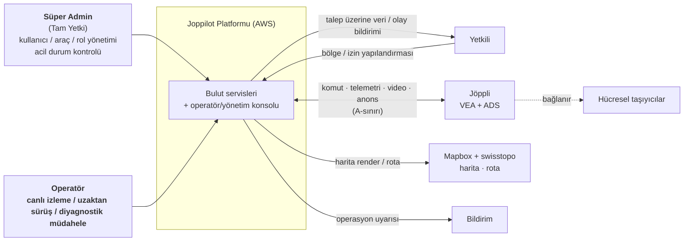
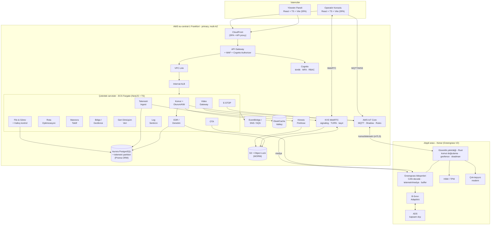
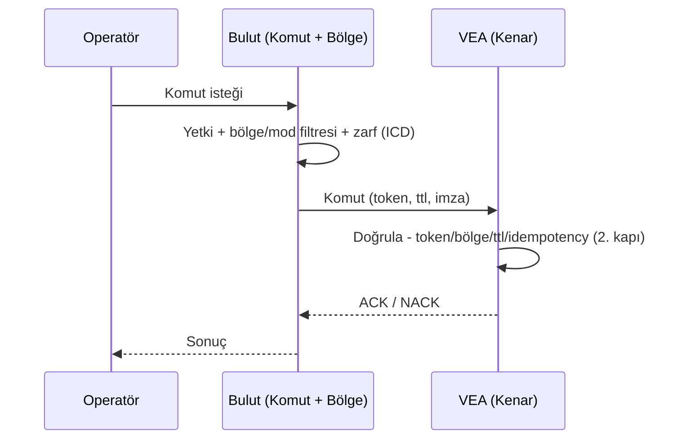
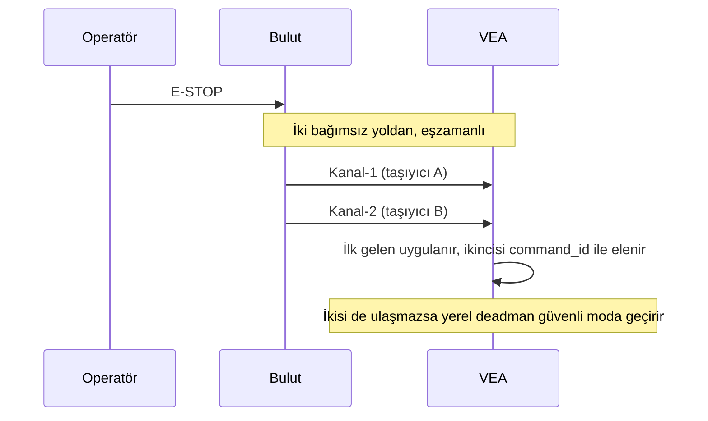
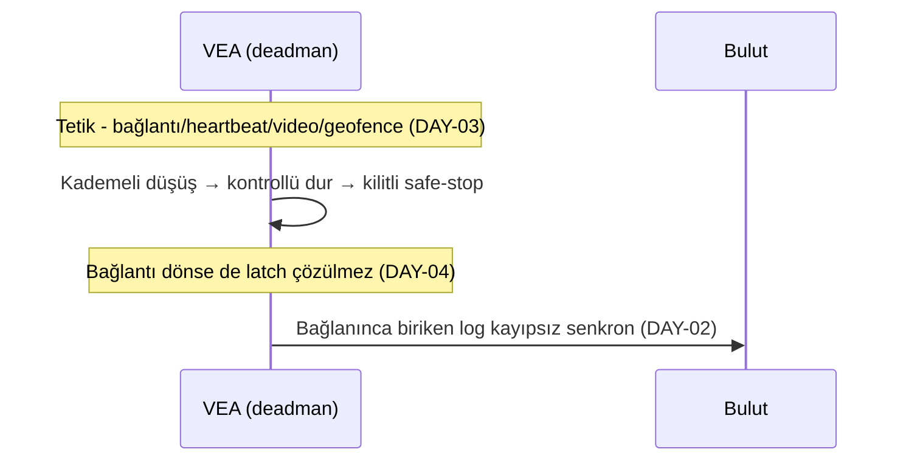
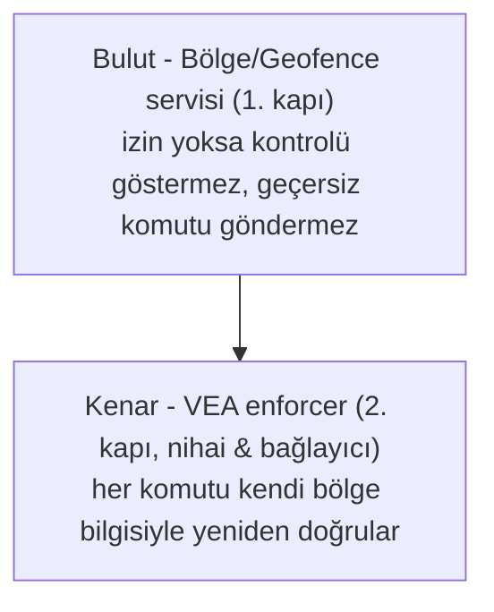
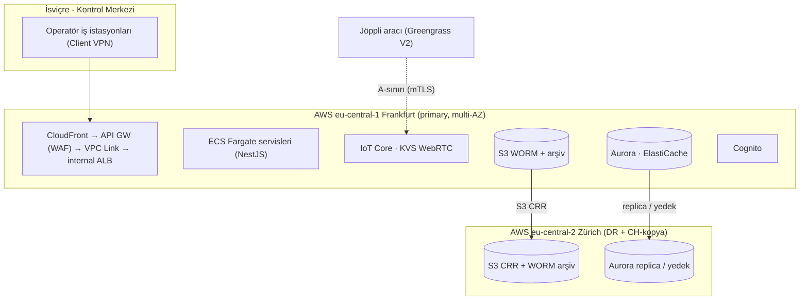

# Joppilot - Yazılım Mimarisi

**Kapsam:** Joppilot - Filo Yönetimi & Uzaktan Kontrol/Denetim Platformu

> Bu doküman **yalnızca yazılım mimarisini** tanımlar. Kısıt kodları (KAP/YAS/VER/GUV/RTP/DAY/PLT/ERS/DIL/OPS/STD) `joppilot_constraints.md`'ye; mod/komut/sınır detayları `joppilot_interface_contract.md`'ye (ICD) aittir.

## 1. Amaç & Mimari Sürücüler

Mimariyi şekillendiren, **mimari açıdan anlamlı** kısıtlar (metinleri constraints'tedir; burada yalnızca mimari etki + kod):

| # | Sürücü | Mimari etki | Kısıt |
|---|---|---|---|
| AD-1 | Gerçek zaman | Telemetri/video/komut/E-STOP **ayrı kanallar**, farklı gecikme-güvenilirlik garantileri; komut yolu video'dan bağımsız ve daha sıkı | RTP-01…08 |
| AD-2 | Failsafe | Bağlantı koptuğunda **araç tarafında, buluttan bağımsız** güvenli moda geçiş; kilitli durdurma | DAY-01…06 |
| AD-3 | Güvenlik | Uçtan uca şifreleme + karşılıklı doğrulama, MFA, tek-operatör kilidi, WORM denetim, anında iptal | GUV-01…10 |
| AD-4 | Dayanıklılık | Çok-taşıyıcı bağlantı, kademeli düşüş, çevrimdışı tampon + kayıpsız senkron, dual-path E-STOP | DAY-05/06, RTP-08 |
| AD-5 | Yasal uyum | Bölge tabanlı mod yönetimi, operatör İsviçre'de, kalkış-öncesi kontrol, zaman-senkron/değiştirilemez olay kaydı | YAS-01…07 |
| AD-6 | Veri koruma | Veri minimizasyonu, talep-üzerine video, yüz/plaka anonimleştirme, veri-özne hakları | VER-01…10 |
| AD-7 | Ölçek | ~10 araç, ≥5 kamera/araç; dikey büyümeyi engellemeyen seçimler | OPS-01…04 |

## 2. C4 Seviye 1 - Sistem Bağlamı

Gerçek dış bağımlılıklar **araç**, **hücresel taşıyıcılar** ve **harita sağlayıcılarıdır** (Mapbox + swisstopo). Bildirim AWS yönetilen servisidir (platformun parçası). Yetkili için ayrı konsol yoktur (talep üzerine veri/EDR + olay bildirimi); kanton onayları sisteme **yapılandırma** olarak girer.

## 3. C4 Seviye 2 - Konteyner

## 4. Çekirdek Veri Akışları

> Komut zarfı alanları, ACK/NACK ve manevra şeması **ICD'de** tanımlıdır; burada akışın **mimari** sırası gösterilir.

### 4.1 Komut akışı (Mode 1/2)

### 4.2 E-STOP akışı

### 4.3 Failsafe akışı

## 5. Bölge Tabanlı Yetkilendirmenin Mimari Karşılığı

Mod (Mode 1/2) ↔ bölge tipi kuralları, **bölge-mod matrisi** ve **test izni istisnası** **ICD'de** tanımlıdır. Mimaride bu, **iki katmanlı** gerçeklenir:

Nihai/bağlayıcı denetim **araçtadır** (bulut yanılabilir/kopabilir/saldırıya uğrayabilir - DAY-01, GUV-04). Kanton onayları ve test izinleri sisteme **bölge yapılandırması** olarak girer; çalışma anında bir rol (Süper Admin dâhil) kuralı geçersiz kılamaz. 

## 6. Teknoloji Yığını (yönetilen-öncelikli)

> **İlke:** Varsayılan **yönetilen (hazır) AWS servisi**. Self-host yalnızca (a) yönetilen servis ileride **büyük problem** yaratacaksa, (b) ihtiyacı karşılayan **net bir yönetilen servis yoksa**, (c) **zorunlu bir beklentiyi** (düşük gecikme, güvenlik, veri yerleşimi) karşılayan yönetilen servis yoksa önerilir (PLT-03). Bu belgede yalnızca **iki** istisna vardır; ikisi de işaretlidir.

### 6.1 Bulut katmanı

| Katman | Seçim (yönetilen) | Gerekçe | Self-host gerekirse |
|---|---|---|---|
| Altyapı | **AWS** (PLT-01) | Kısıt | - |
| CDN + ön kapı | **CloudFront** | SPA dağıtımı + API trafiğini API Gateway'e proxy; DDoS koruması, uç önbellekleme | - |
| API ağ geçidi | **API Gateway + WAF + Cognito Authorizer → VPC Link → internal ALB** | tek giriş noktası; throttling, yetkilendirme ve WAF tek yüzeyde; ECS **asla** halka açık değil | - |
| Kimlik / RBAC | **Amazon Cognito** | MFA (GUV-03), davet usulü, grup→rol | Keycloak yalnızca ince RBAC yetmezse |
| Komut/telemetri omurgası | **AWS IoT Core + Greengrass V2** | yönetilen MQTT, Shadow, Rules, mTLS, OTA | - |
| Filo güvenlik izleme | **IoT Device Defender** | sertifika/anomali (GUV-10) | - |
| Video/ses | **KVS WebRTC** *(POC kapısı)* | yönetilen signaling+TURN+kayıt, on-demand, çift yön ses | **POC geçmezse:** LiveKit/mediasoup + coturn (EC2) - *istisna (c)* |
| Komut kanalı | **WebRTC Data Channel + IoT Core MQTT QoS1 yedek** | iki yol; fencing token; dual-path E-STOP (DAY-05) | - |
| İlişkisel + telemetri | **Aurora PostgreSQL** (+ pg_partman) | Timestream LiveAnalytics kapandı, Timescale RDS'te yok | alt: Timestream for InfluxDB (DAO arkasında) |
| ORM / migration | **Prisma** | type-safe sorgular, migration yönetimi; TS backend ile doğal uyum | - |
| Ham veri / arşiv | **S3 + Glue + Athena**, Kinesis Firehose | yönetilen data lake | - |
| Olay kaydı (EDR) | **S3 + Object Lock (WORM)** | değiştirilemez kanıt (GUV-06, YAS-04/05) | - |
| Cache/oturum/kilit | **ElastiCache (Valkey)** | düşük gecikme, tek-operatör kilidi (GUV-05) | - |
| Harita render (frontend) | **Mapbox GL JS** | yüksek performanslı harita bileşeni; özelleştirilebilir stil/katman; İsviçre spesifik ihtiyaçlar için swisstopo ile birlikte kullanılır | - |
| Harita veri kaynağı | **swisstopo (geo.admin.ch)** | İsviçre'nin otoriter, ücretsiz coğrafi veri kaynağı; kanton sınırları, tünel/alpin yolları, LV95 koordinatları; rota/bölge tanımı için kullanılır | - |
| Geofence yönetimi | **Custom servis** (Aurora + Valkey cache + edge push) | polygon authoring → Aurora'da saklanır → Valkey'de cache → araç kenarına push; **denetim araçtadır**, bulut servise bağımlılık yok | - |
| İç olay / uyarı | **EventBridge + SNS + SQS** | yönetilen | - |
| Bildirim | **SES + AWS End User Messaging** | yönetilen (Pinpoint kapandı) | - |
| Güvenlik suite | **WAF, Shield Std, GuardDuty, Security Hub, Inspector, Macie, KMS, Secrets Manager, CloudTrail** | yönetilen | - |
| Gözlemlenebilirlik | **CloudWatch + X-Ray** (+ OpenTelemetry SDK) | SLO/gecikme izleme | - |
| Ağ erişim kontrolü | **AWS Client VPN** + IP tabanlı SG'ler | operatör erişimi yalnızca İsviçre kontrol merkezinden (YAS-02, GUV-07) | - |
| VPC endpoints | **ECR, S3, CloudWatch Logs, Secrets Manager, KMS, STS** | NAT veri işleme maliyetini kontrol altında tutar | - |
| IaC / CI-CD | **Terraform + GitHub Actions** | tekrarlanabilir; iki bölge (Frankfurt + Zürich) IaC ile bootstrap | - |

> **Not: Harita seçimi gerekçesi:** Amazon Location Service yerine Mapbox GL JS + swisstopo tercih edilmiştir. swisstopo, İsviçre'nin resmi coğrafi veri kaynağıdır ve kanton sınırları, alpin yolları, tüneller gibi İsviçre'ye özgü verileri otoriter biçimde sağlar. Geofence denetimi zaten araç kenarında gerçekleştirildiğinden (bkz. Bölüm 5) bulut tarafında yönetilen bir geofence servisine bağımlılık gerekmez; polygon verileri Aurora'da saklanır, Valkey'de cache'lenir ve araçlara push edilir.

> **Not: Ingress mimarisi:** Tüm istemci trafiği (SPA + API) CloudFront üzerinden girer. API çağrıları CloudFront → API Gateway (WAF + Cognito Authorizer) → VPC Link → **internal ALB** → ECS Fargate zincirini izler. ECS hiçbir zaman halka açık değildir; WAF ve yetkilendirme tek yüzeyde toplanır.

### 6.2 Kenar (araç üzeri) katmanı

| Bileşen | Seçim | Gerekçe |
|---|---|---|
| İşletim sistemi | Linux tabanlı gömülü OS | gerçek-zaman, donanım desteği |
| **Güvenlik çekirdeği** | **Rust (Greengrass custom component)** - *istisna (a)+(c)* | deadman/geofence/enforcer deterministik, GC duraksamasız, **sıfır bağlantıda** çalışmalı (DAY-01); yönetilen servis araç-içi bunu sağlamaz |
| Diğer kenar işleri | **Greengrass V2 bileşenleri** | CAN decode, telemetri/medya yayını, buffer, OTA - yönetilen |
| Güvenli anahtar | **HSM / TPM** | anahtar çıkarılamaz, kurcalama tespiti (GUV-08) |
| Bağlantı | **Çok-taşıyıcı bonded modem** | erişilebilirlik (DAY-05); *yasal zorunluluk değil; ortak ölü bölgeyi çözmez - güvenlik failsafe'tedir* |
| B-sınırı protokolü | ROS 2 / gRPC / özel - **açık** | ADS ekibiyle ortak (AP) |

### 6.3 İstemci katmanı

| Bileşen | Seçim | Gerekçe |
|---|---|---|
| Operatör konsolu + Yönetim paneli | **React + TypeScript + Vite** (SPA → S3 + CloudFront) | SPA; gerçek-zaman + WebRTC + Gamepad API; statik deploy (sunucu runtime gerekmez); front+back tek dil (TS) |
| i18n | **react-i18next** (anahtar tabanlı, ICU format) | de-CH + en birincil; fr-CH/it-CH eklenebilir (DIL) |
| Erişilebilirlik | WCAG 2.1 AA + eCH-0059 | E-STOP klavye erişimi dâhil (ERS) |

**Diller:** front + back **TypeScript**; **Rust yalnızca araç-içi güvenlik çekirdeğinde**. Bir bulut servisinde sıcak-yol darboğazı ölçülürse o servis Go'ya alınabilir (açık karar).

**Backend framework:** **NestJS** (TypeScript). Modüler mimari, dahili WebSocket/MQTT desteği, OpenAPI 3.1 otomatik üretimi (decorator-based), dependency injection, Guard/Interceptor yapısı (RBAC, fencing token doğrulama). ORM olarak **Prisma** kullanılır.

## 7. Üçüncü Parti / Dış Bağımlılıklar

| Bağımlılık | Amaç | Kritik? | Not |
|---|---|---|---|
| **Hücresel taşıyıcılar** (Swisscom/Sunrise/Salt) | Araç ↔ bulut | Evet | bonded çok-taşıyıcı; **erişilebilirlik** (DAY-05), yasal değil |
| **Mapbox** | harita render (frontend) | Evet | GL JS; stil/katman özelleştirmesi |
| **swisstopo (geo.admin.ch)** | İsviçre coğrafi veri kaynağı | Evet | ücretsiz, otoriter; rota/bölge tanımı, LV95↔WGS84 dönüşümü |
| **Bildirim** (SES / End User Messaging) | operasyon uyarıları | Hayır | AWS yönetilen |
| **OEM / ADS** | araç donanımı + otonomi | Evet | yalnızca **B-sınırı** üzerinden (KAP-03) |

(Belediye veri sistemleri, belediye raporlaması, sakin bildirimleri, ödeme: kapsam dışı veya henüz netleşmemiş - ayrı belgeler.)

## 8. Dağıtım Görünümü

**Neden Frankfurt primary:** IoT Core ve KVS WebRTC **Zürich (eu-central-2) bölgesinde sunulmuyor**; revFADP, EU/AEA barındırmaya (adequacy) izin verir (VER-08). **Zürich** DR + İsviçre toprağında veri kopyası için kullanılır. Operatörler fiziksel olarak İsviçre'de (YAS-02). CH-primary ileride sözleşmeyle şart olursa Aurora/S3 primary'leri Zürich'e taşınır (PLT-02; belgelenmiş Option B).

## 9. Ölçeklendirme

Bağlayıcı mevcut ölçek ve kamera/araç hedefleri **constraints'tedir** (OPS-01/02, RTP-01); tasarım bu ölçeğe boyutlandırılır.

| Boyut | Strateji |
|---|---|
| **Hedef ölçek** | **~10 araçlık filo**; tüm testler ve boyutlandırma bu ölçek üzerinden yapılır (OPS-01) |
| Video oturumları | Talep üzerine; eşzamanlı oturum sayısı filo boyutundan bağımsız (OPS-04) |
| Dikey büyüme | Birincil hedef değil; ancak kritik seçimler (ECS/Aurora/Valkey) ileride engellememeli (OPS-03) |

## 10. Kesişen İlgiler (mimari karşılık)

> Gereksinimler constraints'tedir; burada **mimarinin onları nasıl karşıladığı** yazılır.

- **Denetim / EDR:** kritik aksiyonlar **S3 Object Lock (WORM) + Aurora append-only**, korelasyon kimliğiyle ilişkili (GUV-06, YAS-04/05).
- **i18n:** anahtar tabanlı çeviri altyapısı (react-i18next, ICU format); İsviçre biçimleri - sayı: 1'234.56, tarih: gg.aa.yyyy, saat dilimi: Europe/Zurich (DIL-04).
- **Erişilebilirlik:** frontend WCAG 2.1 AA / eCH-0059; E-STOP klavye erişimi (ERS).
- **Gizlilik:** video **talep-üzerine** (RTP-07); yüz/plaka **anonimleştirme** kenarda/işleme hattında; veri minimizasyonu ve saklama servis sınırlarında uygulanır (VER-03/05/06).
- **Güvenlik:** mTLS + Cognito + KMS + Secrets Manager; komut kanalı en yüksek korumalı yüzey (GUV-01…10).
- **Geri dönüşüm verisi:** hane düzeyinde toplanan veri anonimleştirme/takma adlandırma gerektirir (VER-04); Geri Dönüşüm Veri servisi bu ilkeleri uygular.
- **Kalkış-öncesi kontrol:** dijital iş akışı olarak desteklenir (YAS-03); Filo & Görev servisi içinde; sonuçlar denetim kaydına yazılır.

## 11. Açık Mimari Kararlar

### 11.1 Alınmış kararlar
| # | Karar | Kısıt |
|---|---|---|
| AK-1 | AWS üzerinde çalışma | PLT-01 |
| AK-2 | Çift katmanlı komut doğrulama (bulut + araç) | GUV-04, DAY-01 |
| AK-3 | E-STOP iki bağımsız kanaldan | DAY-05 |
| AK-4 | Video talep-üzerine | RTP-07, VER-03 |
| AK-5 | Bölge tabanlı mod yönetimi | YAS-01 |
| AK-6 | Bağlantı-bağımsız yerel failsafe | DAY-01 |
| AK-7 | WORM denetim günlüğü | GUV-06, YAS-04/05 |
| AK-8 | Operatör İsviçre'de (VPN/ağ kısıtı) | YAS-02, GUV-07 |
| AK-9 | Tek-operatör kilidi (token) | GUV-05 |
| AK-10 | **Yönetilen-öncelikli ilke** (self-host yalnızca 2 istisna) | PLT-03 |
| AK-11 | Omurga: IoT Core + Greengrass V2 | - |
| AK-12 | Video: KVS WebRTC (POC kapısı; geçmezse self-host SFU) | RTP-06 |
| AK-13 | Kimlik: Cognito | GUV-03 |
| AK-14 | Telemetri: Aurora partition (Timestream kapalı, Timescale RDS'te yok) | RTP-02/03 |
| AK-15 | Harita: **Mapbox GL JS + swisstopo**; geofence custom servis (Aurora + Valkey + edge push) | RTP-04/05 |
| AK-16 | **Kenar güvenlik çekirdeği: Rust** (self-host istisnası) | DAY-01, GUV-08 |
| AK-17 | Frankfurt-primary + Zürich-DR | VER-08, PLT-02 |
| AK-18 | Diller: TS (front+back), Rust (kenar) | - |
| AK-19 | Ingress: CloudFront → API Gateway (WAF + Cognito) → VPC Link → internal ALB → ECS | GUV |
| AK-20 | Frontend: React + TypeScript + Vite (SPA, S3+CloudFront) | - |
| AK-21 | Backend: NestJS + TypeScript; ORM: Prisma | - |

### 11.2 Henüz karar verilmemiş noktalar
| # | Konu | Karar verici |
|---|---|---|
| AP-1 | Komut/E-STOP/video kesin gecikme eşikleri + video POC go/no-go | Mühendislik (RTP-06) |
| AP-2 | Olay kaydında tam ne saklanır, ne kadar tutulur | Gizlilik sorumlusu + hukuk/sigorta (VER-06) |
| AP-3 | B-sınırı teklif şeması (neden seti, seçenek, zamanlama) | ADS ekibi |
| AP-4 | Mode 2 sürüş girdileri araçta nereye iner (alt-seviye mi, ADS üzerinden mi) | ADS ekibi |
| AP-5 | B-sınırı protokolü (ROS 2 / gRPC / özel) | ADS + Joppilot |
| AP-6 | Kanton (GL/ZH/BS) bölge koşulları parametre modeli | Yetkilendirme süreci (YAS-06) |
| AP-7 | Heartbeat periyodu/eşikleri, Mode 2 watchdog süreleri | Kenar/gömülü ekip |
| AP-8 | Booking (rezervasyon) yapılacak mı | Ürün ekibi (KAP-05) |
