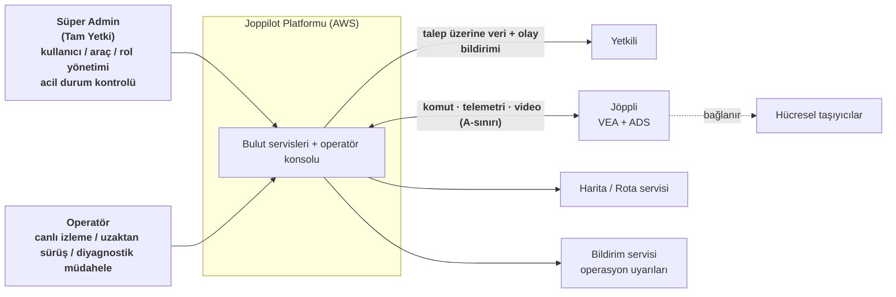
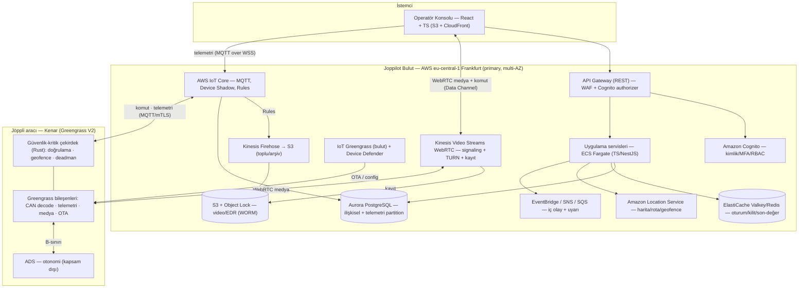
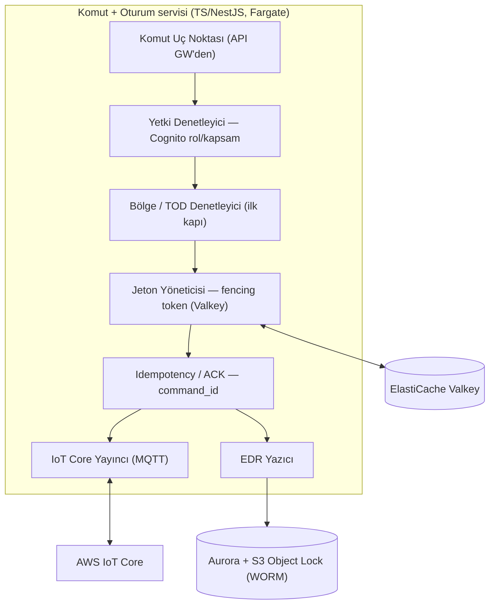
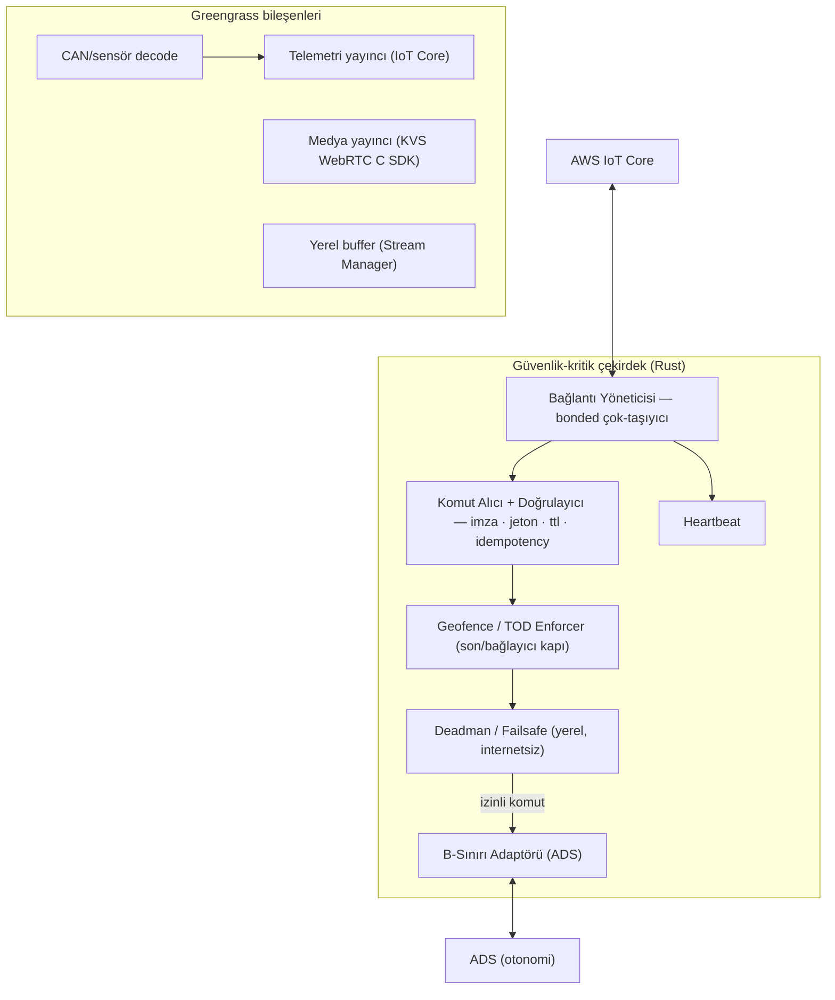

# Joppilot - Yazılım Mimarisi (Software Architecture)

**Temel:** `joppilot_interface_contract_tr.md` (ICD) ve `joppilot_constraints.md` üstüne kurulur. ICD'deki **A-sınırı** (bulut ↔ kenar), **B-sınırı** (kenar ↔ ADS), modlar ve kanallar burada mimariye dökülür.

> **Teknoloji ilkesi:** Varsayılan **yönetilen (hazır) AWS servisi**. Self-host yalnızca şu üç durumda önerilir ve gerekçelendirilir: (a) yönetilen servis bir noktada **büyük problem** yaratacaksa, (b) ihtiyacı karşılayan **net bir yönetilen servis yoksa**, (c) **zorunlu bir beklentiyi** (düşük gecikme, güvenlik, veri yerleşimi) karşılayan yönetilen servis yoksa. Bu belgede self-host yalnızca **iki** yerde önerilir; ikisi de aşağıda işaretlidir.

## 1. Amaç ve mimari sürücüler
 
Bu mimari, İsviçre'de (GL/ZH/BS) kamuya açık yolda otonom çalışan Jöppli filosunun **uzaktan denetimi ve yönetimi** içindir. Tasarımı belirleyen başlıca sürücüler:
 
- **Gerçek-zaman / düşük gecikme:** komut ve video yolları sıkı gecikme bütçesine tabi (RTP-06).
- **Güvenli-varsayılan (failsafe):** kritik güvenlik araçta, **buluttan bağımsız** garanti edilir (DAY-01).
- **Güvenlik:** Sistemde korunması en kritik yer komut kanalıdır (GUV-01…10).
- **Veri koruma & yerleşim:** minimizasyon, anonimleştirme, ileride İsviçre'de saklamaya uyarlanabilirlik (VER-*).
- **Dayanıklılık & kötü bağlantı:** tünel/vadi ölü bölgeleri, çok-taşıyıcı (DAY-05/06).
- **Ölçek:** pilot 5–15 araç → kademeli filo büyümesi.
- **Denetlenebilirlik:** değiştirilemez olay kaydı / kanıt zinciri (YAS-04/05; OAD Art. 7).

## 2. C4 - Seviye 1: Sistem Bağlamı

## 3. C4 - Seviye 2: Konteyner Görünümü (yönetilen AWS)

## 4. C4 - Seviye 3: Component Görünümü

### 4.1 Komut + Oturum çekirdeği (ECS Fargate)

Akış: komut → **yetki** (Cognito) → **bölge/TOD** ilk-kapı → **fencing token** → **idempotency/ACK** → IoT Core'a yayım; her kritik adım EDR'a yazılır. (Nihai/bağlayıcı bölge denetimi araçtadır — 4.2.)

### 4.2 VEA - Araç Kenarı (Rust, Greengrass V2 bileşeni) - *self-host istisnası*

**Neden burada self-host/özel kod?** Deadman, geofence ve komut-enforcement **araç tarafında, sıfır bağlantıda, deterministik** çalışmalı (DAY-01). Bunu sağlayan yönetilen bir servis yoktur; bu yüzden güvenlik-kritik çekirdek **Rust** ile yazılır (bellek güvenliği, GC duraksaması yok) ve Greengrass'ın yönettiği bir bileşen olarak dağıtılır. Çekirdek **kuralı (a)** ve **(c)**'yi karşıladığı için istisnadır. Çevresindeki diğer kenar işleri (CAN decode, telemetri/medya yayını, OTA) **yönetilen Greengrass** üzerinden gider.

## 5. Çekirdek veri akışları

1. **Mode 1 - manevra onayı:** ADS → kenar(B-sınırı) → IoT Core → komut servisi/EDR → konsola kart. Onay → komut servisi (yetki+bölge+jeton) → IoT Core → kenar (yeniden doğrulama) → ADS. Süre dolarsa ADS güvenli varsayılana geçer; her adım EDR'a yazılır.
2. **Mode 2 - doğrudan sürüş:** konsol → komut servisi → IoT Core (veya düşük gecikme için WebRTC Data Channel) → kenar (geofence+jeton) → sürüş girdisi. Taze akış kesilirse kenar watchdog yavaşlatır/durdurur.
3. **Telemetri:** kenar → IoT Core (Basic Ingest) → Rules → Aurora (sıcak partition) + Firehose → S3 (arşiv); son değer Device Shadow/Valkey'de; konsol canlı oradan okur. Eski veri canlı kontrolde oynatılmaz; kayıt için saklanır.
4. **Video/ses:** kenar (KVS WebRTC C SDK) ↔ KVS signaling+TURN ↔ konsol; ihtiyaç üzerine açılır, aktif denetim boyunca sürekli; bağlantıya göre FPS auto; oturum kaydı S3'e (WORM).
5. **Failsafe:** kenar deadman yerel; kopma/geofence ihlali → safe-stop (kilitli). Bağlantı dönünce biriken kayıt kayıpsız yüklenir; latch yetkili eylemle çözülür.
6. **EDR:** kritik olay → Aurora (append-only) + S3 Object Lock (WORM), hash-zinciriyle tamper-evident; Zürich'e replikasyon.

## 6. Teknoloji yığını (yönetilen-öncelikli)

| Katman | Seçim (yönetilen, AWS) | Neden | Self-host gerekirse |
|---|---|---|---|
| Operatör konsolu | **React + TypeScript**, S3 + CloudFront | hazır CDN/hosting, prototiple uyumlu | — |
| Uygulama servisleri | **ECS Fargate** (TS/NestJS) | yönetilen container + otomatik ölçek; front ile tek dil | — |
| Araç bağlantı omurgası | **AWS IoT Core + Greengrass V2** | yönetilen MQTT broker, Device Shadow, Rules, OTA; mTLS/X.509 | — |
| Filo güvenlik izleme | **IoT Device Defender** | yönetilen sertifika/anomali denetimi | — |
| Düşük gecikmeli video/ses | **Kinesis Video Streams WebRTC** | yönetilen signaling+TURN+kayıt, SRTP, on-demand, çift yön ses | **POC geçmezse:** LiveKit/mediasoup SFU + coturn (EC2) — *istisna (c)* |
| Komut kanalı | **WebRTC Data Channel (KVS) + IoT Core MQTT QoS1 yedek** | iki yol; fencing token; dual-path E-STOP | — |
| İlişkisel + telemetri | **Aurora PostgreSQL** (+ pg_partman partition) | yönetilen; Timestream LiveAnalytics kapandı, Timescale RDS'te yok | (alt: Timestream for InfluxDB, DAO arkasında) |
| Ham veri / arşiv | **S3 + Glue + Athena**, Kinesis Firehose | yönetilen data lake | — |
| Olay kaydı (EDR) | **S3 + Object Lock (WORM)** | değiştirilemez kanıt | — |
| Cache / oturum / kilit | **ElastiCache (Valkey/Redis)** | yönetilen, düşük gecikme | — |
| Kimlik / RBAC | **Amazon Cognito** (MFA, JWT) | yönetilen; davet usulü; grup→rol | Keycloak yalnızca Cognito RBAC yetmezse |
| Harita / rota (filo) | **Amazon Location Service** | yönetilen harita/rota/geofence/tracking | OSRM/Valhalla yalnızca özellik/maliyet zorlarsa |
| İç olay / uyarı | **EventBridge + SNS + SQS** | yönetilen | — |
| Bildirim | **SES + AWS End User Messaging + SNS** | yönetilen (Pinpoint kapandı) | — |
| Bölge | **eu-central-1 Frankfurt (primary) + eu-central-2 Zürich (DR/CH-kopya)** | IoT Core + KVS Zürich'te **yok**; revFADP EU barındırmaya izin verir (adequacy) | CH-primary şart olursa Zürich'e taşıma (ek karmaşıklık) |
| Güvenlik | **WAF, Shield Std, GuardDuty, Security Hub, Inspector, Macie, KMS, Secrets Manager, CloudTrail** | yönetilen suite | — |
| Gözlemlenebilirlik | **CloudWatch + X-Ray** (+ OpenTelemetry SDK) | yönetilen; SLO/gecikme izleme | — |
| IaC / CI-CD | **Terraform + GitHub Actions** | standart, tekrarlanabilir | — |
| **Kenar güvenlik çekirdeği** | **Rust (Greengrass custom component)** — *istisna (a)+(c)* | deadman/geofence/enforcer deterministik, GC duraksamasız, sıfır bağlantıda çalışmalı; yönetilen servis araç-içi bunu sağlamaz | (zaten araç-içi) |

**Diller:** front + back **TypeScript** (tek dil, küçük ekip için verimli); **Rust yalnızca araç-içi güvenlik çekirdeğinde**. Bir bulut servisinde sıcak-yol darboğazı ölçülürse o servis Go'ya alınabilir (açık karar).

## 7. Üçüncü parti / dış bağımlılıklar

> ⚠️ TODO: Bu kısma yeniden bakılacak.

- **Hücresel bağlantı:** Swisscom + Sunrise + Salt, bonded (Peplink SpeedFusion sınıfı COTS router) - **erişilebilirlik** için, yasal zorunluluk değil; ortak ölü bölgeyi çözmez (güvenlik failsafe'tedir). Buy-vs-build ADR'si. 

## 8. Dağıtım görünümü

- **Frankfurt (eu-central-1) primary, multi-AZ:** IoT Core, KVS WebRTC, ECS Fargate, Aurora, ElastiCache, S3, Cognito. (IoT Core ve KVS Zürich'te sunulmadığı için primary burada.)
- **Zürich (eu-central-2) DR + CH-kopya:** S3 CRR + WORM arşiv, Aurora cross-region replica/yedek — İsviçre toprağında veri kopyası ve DR hedefi.
- **Kontrol merkezi (operatörler):** fiziksel olarak İsviçre'de (OAD); kablolu hat + AWS Client VPN.
- **Yasal temel:** revFADP, EU/AEA barındırmaya izin verir (adequacy); CH-primary ileride şart olursa Aurora/S3 primary'leri Zürich'e taşınır (belgelenmiş Option B).

## 9. Açık mimari kararları (ADR adayları)

| Karar | Öneri (yönetilen-öncelikli) | Not |
|---|---|---|
| Bölge | Frankfurt primary + Zürich DR | IoT Core + KVS Zürich'te yok; revFADP EU'ya izin verir |
| Video | KVS WebRTC (yönetilen), **POC kapısı** | Gecikme hedefi gerçek CH hücresel + CH↔Frankfurt TURN ile ölçülür; geçmezse self-host SFU (EC2) |
| Kenar güvenlik çekirdeği | **Rust (Greengrass custom component)** | Tek "self-host/özel kod" istisnası; safety/determinism zorunlu beklentisi |
| Telemetri zaman serisi | Aurora partition (yönetilen) | Timestream LiveAnalytics kapalı; Timescale RDS'te yok; alt: Timestream for InfluxDB (DAO arkasında) |
| Kimlik | Cognito (yönetilen) | Keycloak yalnızca ince RBAC yetmezse |
| Harita/rota | Amazon Location Service (yönetilen) | OSRM/Valhalla yalnızca özellik/maliyet zorlarsa |
| Dil | TS (front+back), Rust (kenar) | Hot-path servis gerekirse Go |
| Mode 2 sürüş yolu | (ICD açık notu) | Alt-seviye denetim mi, ADS üzerinden mi — otonomi ekibiyle |
